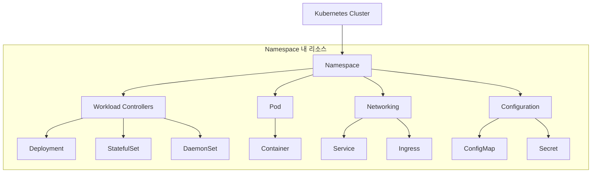

# Kubernetes 리소스 맵

Kubernetes는 다양한 리소스 객체를 유기적으로 결합하여 클러스터를 구성하고 애플리케이션을 실행합니다.

---

## 1. 리소스 계층 구조

클러스터 내부의 리소스들은 논리적으로 다음과 같은 계층을 형성합니다.



---

## 2. 리소스 간 관계도

각 리소스는 독립적으로 존재하지 않고 서로를 참조하거나 포함하는 관계를 가집니다.

| 관계 유형 | 구조 | 설명 |
|-----------|------|------|
| **배포 구조** | `Deployment` → `ReplicaSet` → `Pod` | 선언적 업데이트와 복제본 관리 |
| **네트워크 연결** | `Service` → `Endpoints` → `Pod` | 안정적인 접속 주소 제공 및 로드밸런싱 |
| **설정 주입** | `ConfigMap/Secret` → `Pod` | 환경 변수나 파일(Volume) 형태로 설정 전달 |
| **저장소 연결** | `Pod` → `PVC` → `PV` | 애플리케이션에 영구 저장 공간 할당 |

---

## 3. 핵심 리소스 요약

| 리소스 | 주요 역할 |
|--------|----------|
| **Pod** | 클러스터에서 실행되는 가장 작은 단위 (컨테이너 묶음) |
| **Deployment** | 앱의 원하는 상태를 정의하고 자동으로 유지 (무상태 앱 권장) |
| **StatefulSet** | 정체성과 순서가 중요한 앱 관리 (DB 등 상태 저장 앱) |
| **Service** | Pod 집합에 접근하기 위한 고정된 IP와 이름을 부여 |
| **Namespace** | 하나의 클러스터를 여러 팀이나 프로젝트가 나눠 쓰도록 분리 |

---

## 4. 리소스 탐색 팁

클러스터 내에서 사용할 수 있는 모든 리소스 종류를 확인하려면 다음 명령어를 사용하세요.

```bash
# 전체 리소스 목록 및 약어 확인
kubectl api-resources

# 특정 리소스의 상세 스펙 구조 확인
kubectl explain deployment.spec.template
```

**이러한 리소스들이 어떻게 연결되어 동작하는지 이해하는 것이 Kubernetes 운영의 핵심입니다.**
