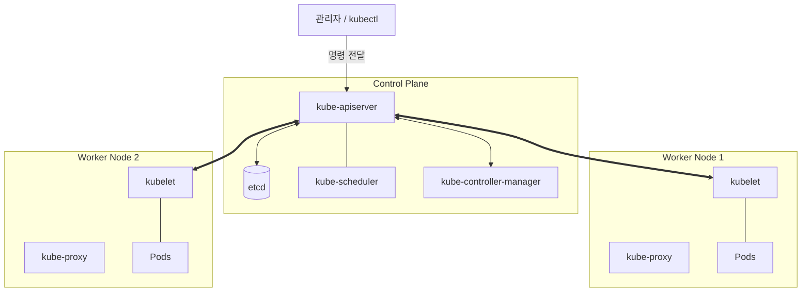

# K8s 클러스터 구성 컴포넌트

Kubernetes 클러스터는 관리를 담당하는 **Control Plane**과 실제 워크로드가 실행되는 **Worker Node**로 구성됩니다.

---

## 1. Control Plane (관리 영역)

| 컴포넌트 | 역할 |
|----------|------|
| **kube-apiserver** | 클러스터의 중앙 통로. 모든 요청을 처리하며 인증/인가를 담당함 |
| **etcd** | 클러스터의 모든 상태 정보를 저장하는 '두뇌' 역할을 하는 키-값 저장소 |
| **kube-scheduler** | 생성된 Pod를 어느 노드에 배치할지 결정하는 스케줄러 |
| **kube-controller-manager** | 노드, 레플리카, 엔드포인트 등 클러스터의 상태를 관리하는 컨트롤러들의 집합 |

---

## 2. Worker Node (작업 영역)

| 컴포넌트 | 역할 |
|----------|------|
| **kubelet** | 각 노드에서 실행되는 관리자. 컨테이너가 Pod 스펙에 따라 실행되도록 보장함 |
| **kube-proxy** | 노드 내부의 네트워크 규칙을 관리하고 서비스로의 트래픽을 라우팅함 |
| **Container Runtime** | 실제로 컨테이너를 실행하는 소프트웨어 (containerd, CRI-O 등) |

---

## 3. 전체 아키텍처 다이어그램

컴포넌트 간의 상호작용을 한눈에 보여주는 아키텍처 구조입니다.

**각 컴포넌트는 유기적으로 연결되어 있으며, API 서버를 중심으로 클러스터의 선언적 상태(Desired State)를 유지하기 위해 협력합니다.**
