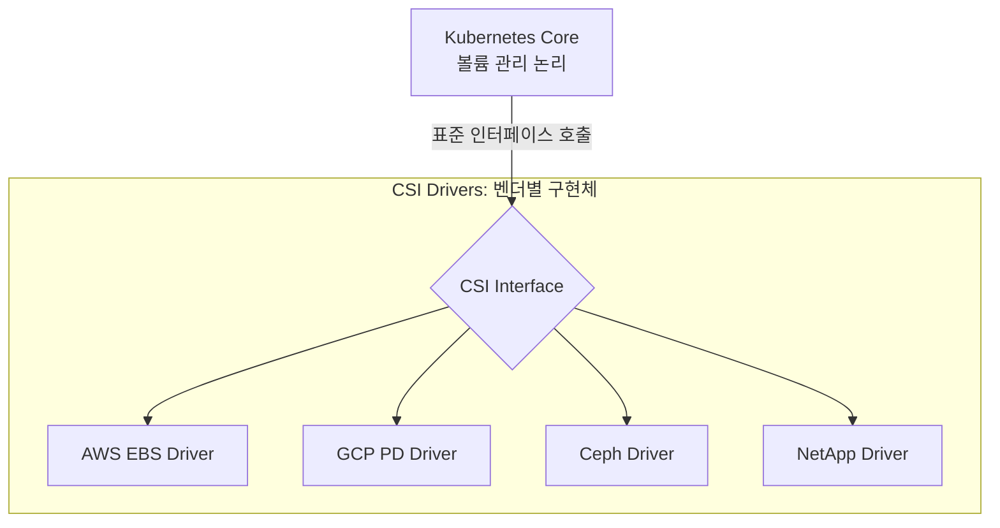

# K8s CSI (Container Storage Interface) 의 철학

CSI는 Kubernetes가 특정 저장소 벤더에 종속되지 않고 유연하게 확장할 수 있도록 만든 핵심 표준 규격입니다.

---

## 1. CSI 란?

**Container Storage Interface(CSI)**는 컨테이너 오케스트레이션 도구(Kubernetes 등)와 다양한 스토리지 벤더(AWS, Google, Dell, NetApp 등) 간의 통신을 위한 표준 인터페이스입니다.

---

## 2. CSI의 핵심 철학

### 1) 벤더 중립성 (Vendor Neutrality)
Kubernetes 소스 코드 내에 특정 기업의 스토리지 제어 코드를 직접 넣지 않습니다. 대신 표준 규격만 정의하여 누구나 맞춰서 개발할 수 있게 합니다.

### 2) 책임의 분리 (Separation of Concerns)
클러스터 관리 로직과 실제 하드웨어 제어 로직을 명확히 분리합니다.

### 3) 플러그 가능성 (Pluggability)
새로운 스토리지 기술이 나와도 Kubernetes 자체를 업그레이드할 필요가 없습니다. 해당 스토리용 CSI 드라이버만 설치하면 즉시 연동됩니다.

---

## 3. CSI 동작의 주요 단계

모든 CSI 드라이버는 다음과 같은 공통된 워크플로우를 따릅니다.

| 단계 | 함수명 | 역할 |
|------|--------|------|
| **볼륨 연결** | `ControllerPublish` | 물리적인 볼륨(EBS 등)을 특정 노드에 연결(Attach) |
| **스테이징** | `NodeStage` | 노드에 연결된 장치를 포맷하거나 전처리 수행 |
| **마운트** | `NodePublish` | 실제 Pod가 사용할 경로에 볼륨을 마운트 |
| **언마운트** | `NodeUnpublish` | Pod 종료 시 마운트 해제 |

---

## 4. CSI 도입의 장점

- **릴리스 독립성:** 스토리지 벤더는 Kubernetes 업데이트와 상관없이 자유롭게 드라이버 기능을 개선할 수 있습니다.
- **안전성:** 드라이버 코드가 Kubernetes 핵심 프로세스 밖에서 실행되므로, 드라이버 오류가 클러스터 전체의 중단으로 이어지지 않습니다.
- **다양한 선택지:** 로컬 디스크부터 고성능 엔터프라이즈 스토리지까지 동일한 YAML 문법으로 사용 가능합니다.

**CSI는 Kubernetes를 진정한 '클라우드 운영체제'로 만들어주는 핵심적인 확장 메커니즘입니다.**
