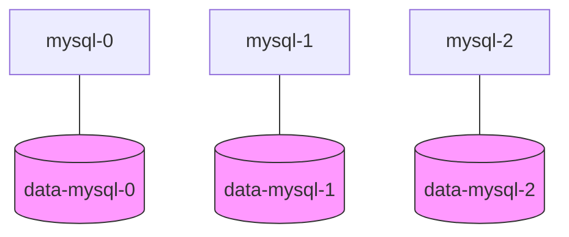
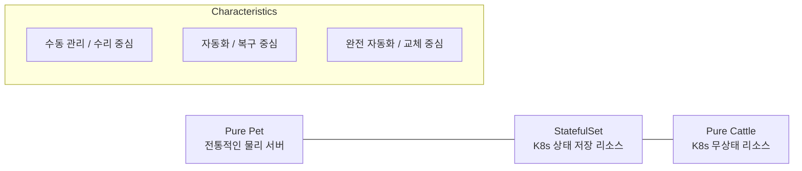

# StatefulSet - Pet 적 특성을 가진 K8s 리소스

Kubernetes는 기본적으로 **Cattle(가축)** 철학을 따르지만, **StatefulSet**은 예외적으로 **Pet(애완동물)**에 가까운 특성을 가집니다.

---

## StatefulSet이 Pet인 이유

StatefulSet은 일반적인 Deployment와 달리 각 Pod가 고유한 정체성을 유지하도록 설계되었습니다.

### 1. 고유하고 예측 가능한 식별자

| 구분 | Deployment (Cattle) | StatefulSet (Pet) |
|------|--------------------|-------------------|
| **이름 규칙** | `web-abc12` (무작위 해시) | `mysql-0`, `mysql-1` (순차적 번호) |
| **정체성** | 모든 Pod가 동일함 (교체 가능) | 각 Pod가 고유한 역할 보유 가능 |
| **순서** | 병렬로 한꺼번에 생성/삭제 | 0번부터 순차적으로 생성, 역순으로 삭제 |

### 2. 안정적인 네트워크 ID (DNS)

Deployment의 Pod는 삭제 후 재생성되면 이름이 바뀌어 통신 주소가 변경되지만, StatefulSet은 **재생성되어도 동일한 DNS 주소**를 유지합니다.

- **DNS 주소 형식:** `<Pod이름>.<서비스이름>.<네임스페이스>.svc.cluster.local`
- **장점:** `mysql-1`이 죽었다 살아나도 다른 Pod들은 여전히 동일한 주소로 `mysql-1`을 찾을 수 있습니다.

### 3. 영구 저장소의 1:1 매칭

각 Pod는 자신만의 전용 저장소(Persistent Volume)를 가지며, Pod가 재시작되어도 자신의 데이터를 그대로 유지합니다.

---

## Pet vs Cattle vs StatefulSet 스펙트럼

관리 철학의 차이를 시각화하면 다음과 같습니다.

---

## 주요 사용 사례

1.  **데이터베이스 클러스터:** Master/Slave 구조가 명확해야 하는 MySQL, PostgreSQL 등
2.  **분산 메시지 큐:** 노드 간의 ID가 중요한 Kafka, RabbitMQ 등
3.  **분산 저장소:** 클러스터 구성 시 고정된 멤버 정보가 필요한 MongoDB, Cassandra 등

---

## 요약: StatefulSet의 핵심 가치

- **고유성:** 각 Pod는 0, 1, 2... 번호와 함께 고유한 정체성을 가짐
- **안정성:** 재시작되어도 이름과 네트워크 주소가 변하지 않음
- **영속성:** 전용 볼륨을 통해 데이터가 보존됨

**StatefulSet은 "관리되는 Pet" 또는 "Cattle의 옷을 입은 Pet"이라 할 수 있으며, Kubernetes 환경에서 복잡한 상태 저장 애플리케이션을 운영할 수 있게 해주는 핵심 도구입니다.**
