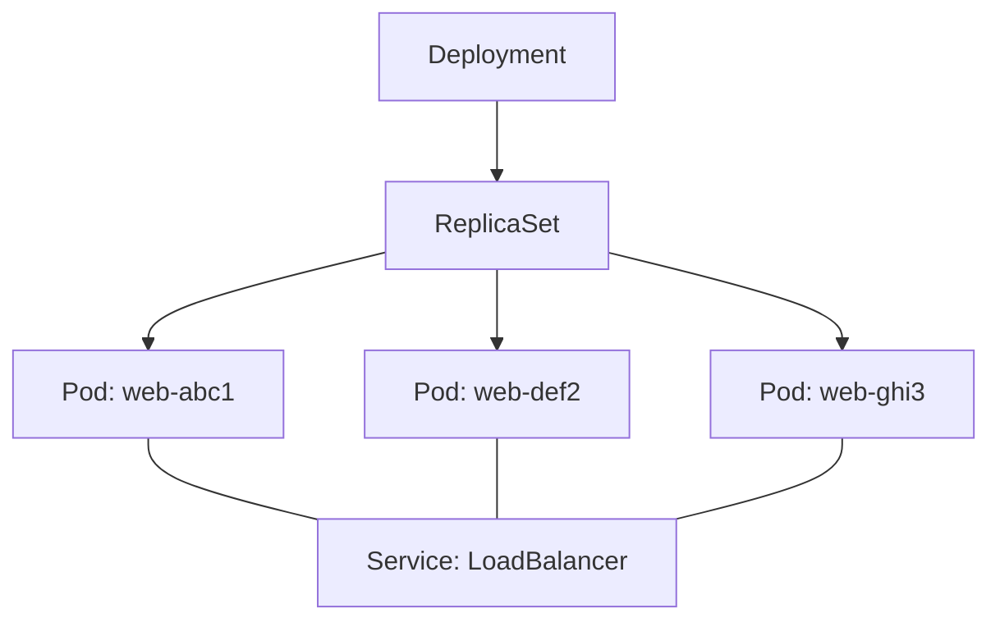
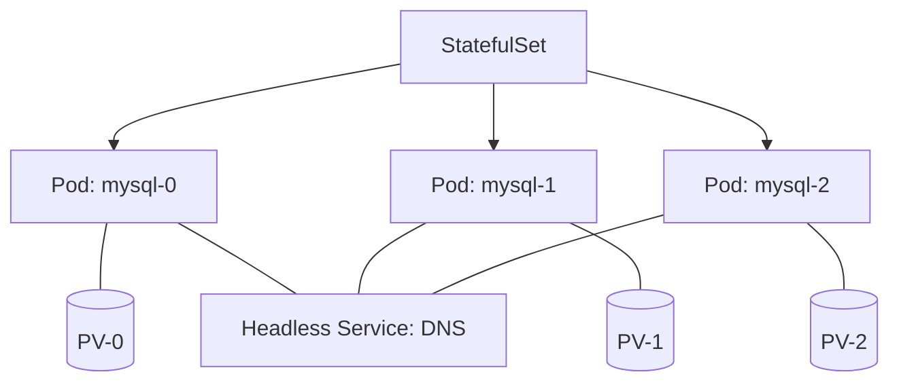
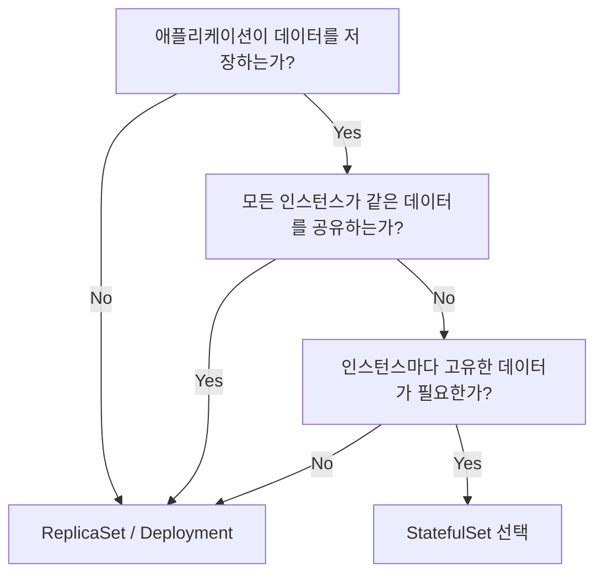

# StatefulSet vs ReplicaSet - 상세 비교

Kubernetes에서 Pod를 대량으로 관리하는 두 가지 핵심 리소스인 StatefulSet과 ReplicaSet의 차이점을 분석합니다.

---

## 1. 기본 개념 비교

| 리소스 | 핵심 철학 | 주요 대상 | 관리 도구 |
|------|-----------|----------|-----------|
| **ReplicaSet** | **Cattle (가축):** 모든 Pod가 동일하며 교체 가능 | 웹 서버, API 등 무상태(Stateless) 앱 | Deployment |
| **StatefulSet** | **Pet (애완동물):** 각 Pod가 고유한 정체성 보유 | DB, 메시지 큐 등 상태 저장(Stateful) 앱 | 직접 관리 |

---

## 2. 아키텍처 비교

### ReplicaSet (Deployment)
모든 Pod가 무작위 이름을 가지며, 서비스는 이를 하나의 덩어리로 묶어 로드밸런싱합니다.

### StatefulSet
각 Pod가 순차적 이름을 가지며, 전용 저장소(PV)와 1:1로 매핑됩니다. Headless Service를 통해 개별 Pod에 직접 접근합니다.

---

## 3. 상세 기능 비교

| 특성 | ReplicaSet (Deployment) | StatefulSet |
|------|------------------------|-------------|
| **Pod 이름** | 무작위 해시 (`web-abc12`) | 순차적 번호 (`mysql-0`, `mysql-1`) |
| **스케일링** | 즉시 병렬 생성/삭제 | 0번부터 순차 생성, 역순 삭제 |
| **네트워크 ID** | 재생성 시 이름/IP 변경 | **재생성되어도 동일 이름(DNS) 유지** |
| **데이터 보존** | 모든 Pod가 공통 볼륨 사용 가능 | **각 Pod마다 전용 볼륨 할당 및 보존** |
| **업데이트** | 롤링 업데이트 (빠름) | 순차적 업데이트 (신중함) |

---

## 4. 선택 가이드 (결정 트리)

애플리케이션의 특성에 따라 아래 흐름도를 따라 선택하세요.

---

## 5. 요약

- **ReplicaSet**은 "동일한 기능을 하는 복제본을 많이 늘리는 것"에 집중합니다.
- **StatefulSet**은 "각 복제본이 고유한 이름과 데이터를 유지하는 것"에 집중합니다.

**애플리케이션의 '상태(State)' 유무가 리소스 선택의 가장 중요한 기준입니다.**
