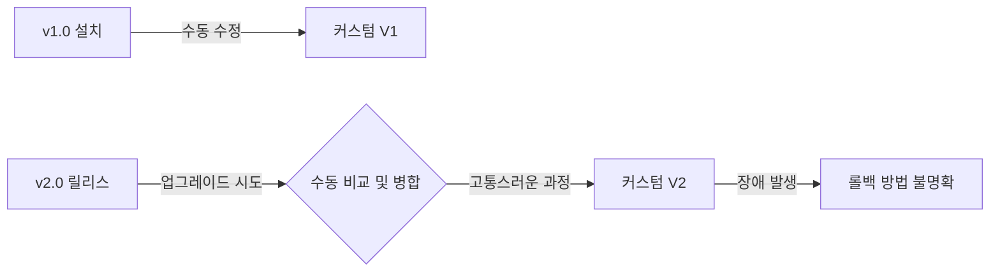
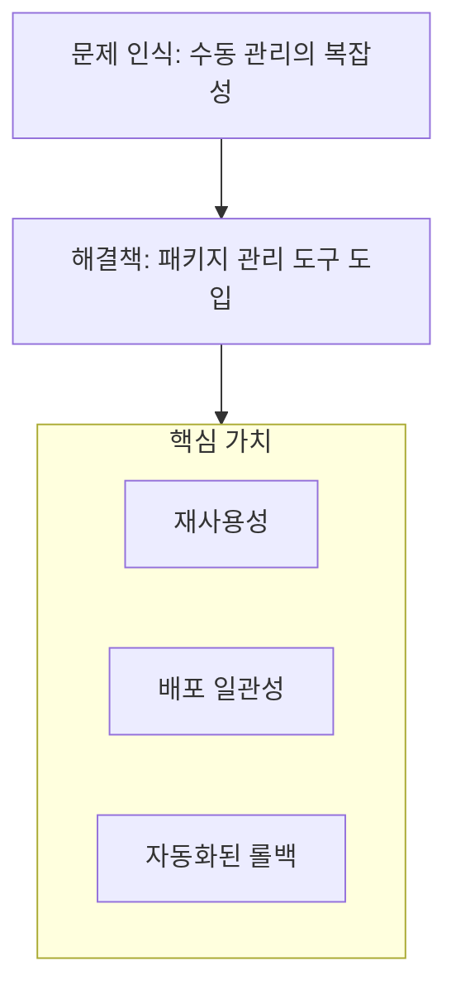

# 패키지 관리 도구의 출현 배경

Kubernetes Add-On 컴포넌트 구성의 문제점에서부터 Helm과 같은 패키지 관리 도구가 왜 필요하게 되었는지 살펴봅니다.

---

## 1. Add-On 구성의 전통적인 문제점

### 1) 수동 YAML 관리의 한계
컴포넌트 설치 시 환경에 맞춰 변경해야 할 부분이 많지만, 이를 매번 수동으로 수정하는 것은 매우 위험합니다.

| 문제 유형 | 상세 내용 |
|-----------|-----------|
| **휴먼 에러** | 수동 편집 시 오타나 설정 누락 발생 가능성 높음 |
| **일관성 부족** | 개발, 테스트, 운영 환경 간의 미세한 설정 차이 발생 |
| **추적 불가** | 누가 어느 시점에 어떤 설정을 바꿨는지 기록이 남지 않음 |

### 2) 버전 관리 및 업그레이드 이력
새로운 버전으로 업데이트할 때 이전의 커스터마이징 내용을 다시 적용하고 비교하는 과정이 고통스럽습니다.

---

## 2. 왜 패키지 관리 도구가 필요한가?

복잡한 클러스터 운영 요구사항을 만족하기 위해서는 다음과 같은 기능이 필수적입니다.

### 요구사항 및 해결책

| 요구사항 | 설명 | 패키지 관리자의 해결 방식 |
|----------|------|------------------------|
| **템플릿화** | 설정의 재사용성 확보 | `values.yaml`을 통한 변수 주입 |
| **버전 관리** | 배포 이력 추적 및 롤백 | 릴리스(Release) 버전 단위 관리 |
| **지식 패키징** | 전문가의 최적 설정 공유 | 검증된 차트(Chart) 제공 |
| **의존성 해결** | 여러 컴포넌트 간 연동 자동화 | 서브 차트(Sub-charts) 관리 |

---

## 3. 대표적인 도구들

현재 Kubernetes 생태계에서는 다음과 같은 도구들이 각자의 영역에서 활용되고 있습니다.

- **Helm:** 가장 널리 쓰이는 표준 패키지 관리자 (템플릿 기반)
- **Kustomize:** 템플릿 없이 선언적인 YAML 오버레이 방식 (kubectl 내장)
- **ArgoCD / Flux:** GitOps 모델을 기반으로 패키지 배포 자동화

---

## 4. 요약

**Kubernetes 패키지 관리 도구는 단순한 편의를 넘어, 대규모 클러스터를 안전하고 일관되게 운영하기 위한 필수 요소입니다.**
