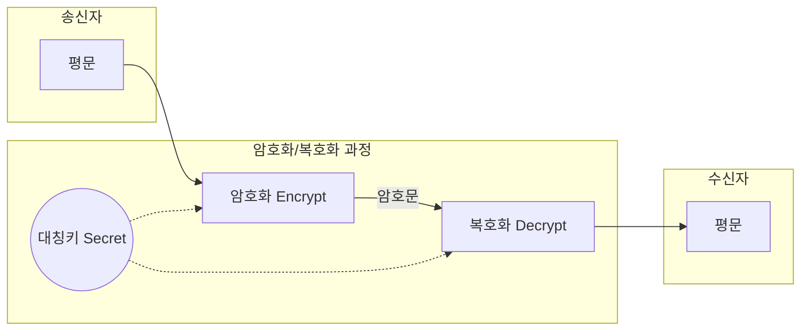
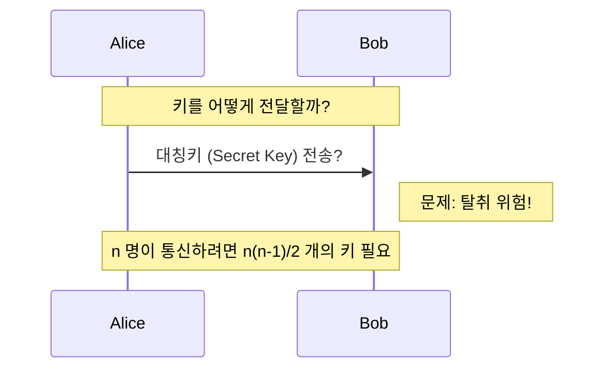
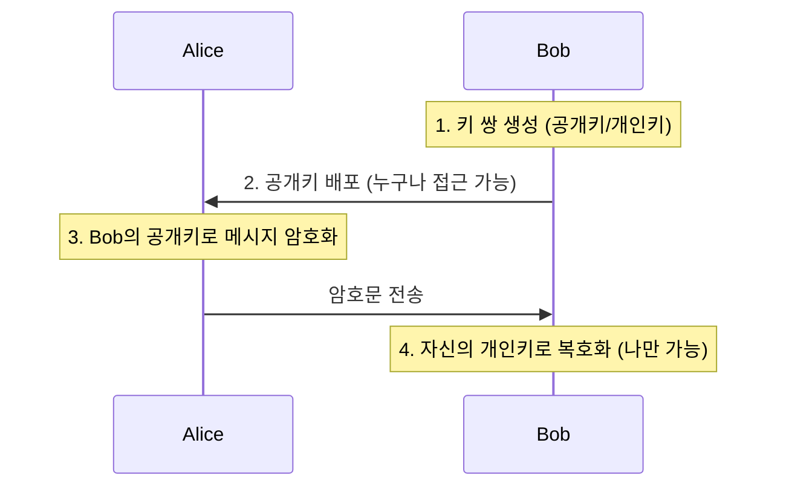
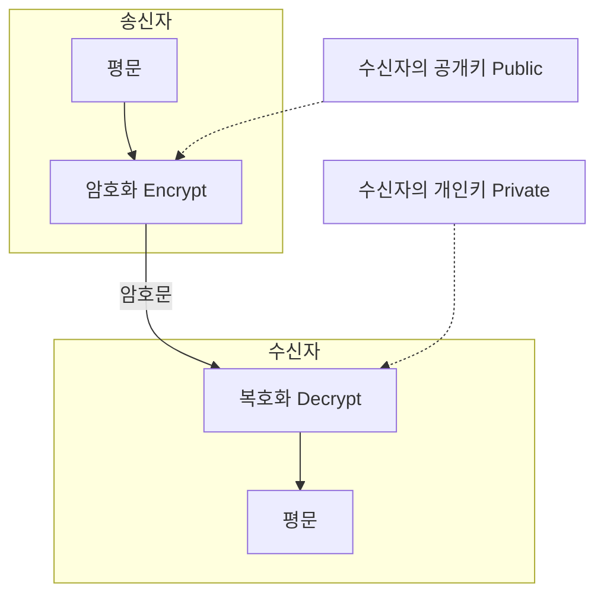

# 대칭키와 비대칭키 - Kubernetes 인증 이해를 위한 기초

Kubernetes 의 인증 방식을 이해하기 위해 암호화의 기본 개념인 대칭키와 비대칭키에 대해 알아봅니다.

## 암호화 기본 개념

```
평문 (Plaintext) → [암호화] → 암호문 (Ciphertext)
암호문 (Ciphertext) → [복호화] → 평문 (Plaintext)
```

- **평문**: 암호화되지 않은 원본 데이터
- **암호문**: 암호화된 데이터
- **키 (Key)**: 암호화/복호화에 사용되는 비밀 값

---

## 대칭키 암호화 (Symmetric Key Encryption)

### 개념



**핵심: 암호화와 복호화에 동일한 키 사용**

### 특징

| 특성 | 설명 |
|------|------|
| **키 개수** | 1 개 (송신자와 수신자가 공유) |
| **속도** | 빠름 (하드웨어 가속 용이) |
| **키 배포** | 어려움 (보안 채널 필요) |
| **용도** | 대량 데이터 암호화 |

### 대표 알고리즘

| 알고리즘 | 키 길이 | 설명 |
|----------|---------|------|
| **AES** | 128, 192, 256 비트 | 현재 가장 널리 사용 (권장) |
| **DES** | 56 비트 | 구식 (취약, 사용 금지) |
| **3DES** | 168 비트 | DES 개선 (점차 퇴출) |
| **ChaCha20** | 256 비트 | AES 대안 (소프트웨어 최적화) |

### 예시: AES-256

```python
# 의사코드 예시
key = "0123456789abcdef0123456789abcdef"  # 256 비트 (32 바이트)
plaintext = "Hello, Kubernetes!"

# 암호화
ciphertext = AES_Encrypt(key, plaintext)
# 결과: "a1b2c3d4e5f6..." (암호문)

# 복호화
decrypted = AES_Decrypt(key, ciphertext)
# 결과: "Hello, Kubernetes!" (원본 복원)
```

### 대칭키의 문제점: 키 배포



### 키 배포 문제의 본질

> **"키 배송의 역설"**
> 
> 상황: Alice 가 Bob 에게 비밀 메시지를 보내고 싶음
> 
> **문제:**
> 1. 메시지를 암호화하려면 공통의 키가 필요함
> 2. 하지만 키를 안전하게 전달할 방법이 없음
> 3. 키를 보내다가 해커에게 탈취당하면 모든 통신 노출!
> 
> **역설:**
> "보안 통신을 하려면 안전한 키 배송이 필요하지만, 안전한 키 배송을 하려면 이미 보안 통신이 필요하다."

### 키 배포 시나리오

| 시나리오 | 설명 | 장점 | 단점 |
|----------|------|------|------|
| **직접 전달** | USB 등에 담아 오프라인 전달 | 안전함 | 비실용적, 확장성 없음 |
| **암호화 채널** | 키를 암호화해서 전송 | 편리함 | "키를 위한 키" 무한 루프 문제 |
| **제 3 자 의존** | 신뢰할 수 있는 전달자 이용 | 실용적 | 제 3 자 해킹 시 모든 키 유출 |

### 키 관리 복잡성

n 명이 상호 통신할 때 필요한 키 수: **n(n-1)/2**

| 사용자 수 | 필요한 키 개수 | 비고 |
|-----------|----------------|------|
| 2 명 | 1 개 | 관리 가능 |
| 10 명 | 45 개 | 조금 복잡 |
| 100 명 | 4,950 개 | 관리 어려움 |
| 1,000 명 | 499,500 개 | 현실적으로 불가능 |

---

## 비대칭키가 해결한 문제: 키 배포

### 비대칭키의 핵심 아이디어



### 공개키 배포 방법

1.  **웹사이트 게시:** `https://bob.com/public-key.pem` 등 누구나 다운로드 가능하게 게시
2.  **공개 키 디렉토리:** 키 서버(`keys.openpgp.org` 등)에 등록하여 검색 가능하게 함
3.  **디지털 인증서 (CA):** 신뢰할 수 있는 기관(CA)이 소유자 정보와 공개키를 묶어 서명한 인증서 형태

### 비대칭키의 장점/단점

| 구분 | 내용 |
|------|------|
| **장점** | 키 배포 용이, 사전 공유 불필요, 키 관리 간단 (n개), 디지털 서명 가능 |
| **단점** | 대칭키보다 100~1000배 느림, 긴 키 길이, 개인키 분실/유출 시 치명적 |

---

## 비대칭키 암호화 (Asymmetric Key Encryption)

### 개념



### 두 가지 사용 방식

#### 1. 기밀성 (Confidentiality) - 암호화
- **방법:** 수신자의 **공개키**로 암호화 → 수신자의 **개인키**로 복호화
- **결과:** 수신자 본인만 읽을 수 있는 보안 통신 보장

#### 2. 인증 (Authentication) - 디지털 서명
- **방법:** 송신자의 **개인키**로 서명 → 송신자의 **공개키**로 검증
- **결과:** 송신자의 신원 확인 및 데이터 위변조 방지 (부인 방지)

---

## 하이브리드 방식: TLS/SSL

현대 암호화 통신은 대칭키와 비대칭키의 장점을 결합하여 사용합니다.

### TLS 핸드셰이크 흐름 (간략화)

```mermaid
sequenceDiagram
    participant C as 클라이언트
    participant S as 서버
    
    C->>S: 1. ClientHello (지원 목록 전달)
    S->>C: 2. ServerHello + 인증서 (서버 공개키 포함)
    Note over C: 3. 인증서 검증 및 프리마스터 시크릿 생성
    C->>S: 4. 서버 공개키로 암호화된 프리마스터 시크릿 전송
    Note over S: 5. 개인키로 복호화하여 시크릿 획득
    Note over C,S: 6. 양쪽에서 동일한 세션 키 (대칭키) 생성
    C<->>S: 7. 생성된 대칭키로 고속 암호화 통신 시작
```

---

## Kubernetes 와의 연관성

Kubernetes 내부의 다양한 보안 영역에서 이 메커니즘들이 활용됩니다.

1.  **API Server TLS:** 서버/클라이언트 인증서(비대칭키)와 실제 데이터 통신(대칭키) 결합
2.  **ServiceAccount:** 개인키로 토큰에 서명하고, 공개키로 위변조 여부 검증
3.  **Secret 암호화:** etcd 저장 시 AES(대칭키) 사용, 키 관리는 KMS(비대칭키/KMS) 연동 가능

---

## 요약

| 구분 | 대칭키 | 비대칭키 |
|------|--------|----------|
| **키 개수** | 1개 (공유) | 2개 (공개키 + 개인키) |
| **속도** | 매우 빠름 | 느림 |
| **키 배포** | 어려움 | 쉬움 |
| **주 용도** | 대량 데이터 암호화 | 키 교환, 디지털 서명, 인증 |
| **대표 알고리즘** | AES, ChaCha20 | RSA, ECDSA, Ed25519 |

**대칭키와 비대칭키의 하이브리드 운영 원리를 이해하는 것이 Kubernetes 보안의 시작입니다.**
