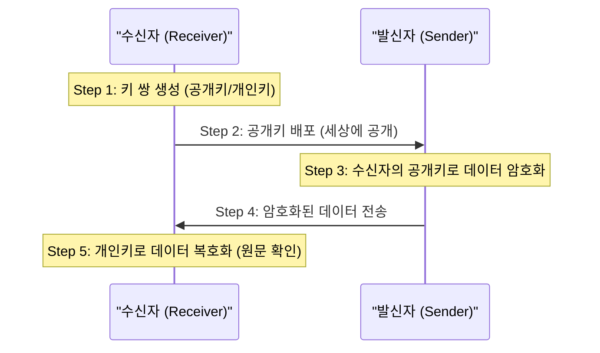
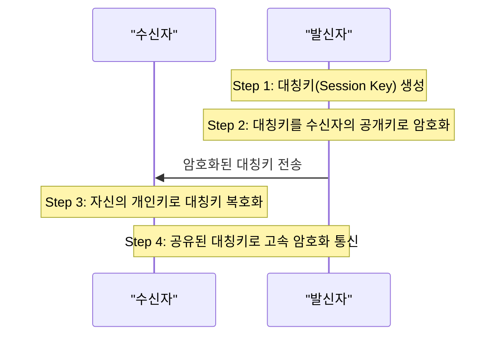
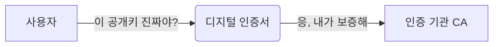
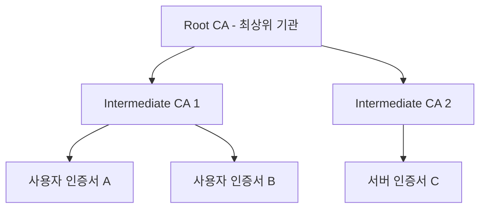

# 인증서 발급 기관: Root CA 와 CA

Kubernetes API Server 인증서 이해를 위한 인증서 발급 기관 (CA) 에 대해 알아봅니다.

---

## 공개키 배포와 암호화 과정

### 1. 수신자는 공개키를 공개하는가?

네, 공개키 (Public Key) 는 말 그대로 누구에게나 알려져도 됩니다.

- **웹사이트의 경우:** 웹 서버(수신자)는 접속하려는 모든 사용자에게 자신의 공개키를 담은 인증서를 미리 배포하거나 요청 시 즉시 전달합니다.
- **개인의 경우:** 자신의 공개키를 키 서버(Key Server)에 등록하거나 이메일 서명 등에 첨부하여 상대방이 언제든 가져가서 사용할 수 있게 합니다.

### 2. 암호화 → 복호화 과정



### 3. 하이브리드 방식: 대칭키 + 비대칭키

비대칭키만 사용하지 않는 이유는 연산 속도가 대칭키보다 100-1000배 느려 대용량 데이터 암호화에 부적합하기 때문입니다.



---

## 디지털 서명 (Digital Signature)

### 1. 개인키로 서명하는가?

네, 디지털 서명은 자신의 **개인키 (Private Key)** 로 수행합니다.

- **암호화:** 타인이 나에게 보낼 때 (수신자의 공개키 사용)
- **서명:** 내가 타인에게 보낼 때 (송신자의 개인키 사용)

### 2. 서명 및 검증 과정

```mermaid
flowchart TD
    subgraph "송신자"
    D1["원본 데이터"] --> H1["해시 함수"]
    H1 --> HV1["해시 값"]
    HV1 --> S_SIG["서명 생성 - 송신자 개인키"]
    end
    
    subgraph "수신자"
    D2["수신 데이터"] --> H2["해시 함수"]
    H2 --> HV2["해시 값 1"]
    S_SIG -- "서명 전달" --> V["서명 검증 - 송신자 공개키"]
    V --> HV3["해시 값 2"]
    HV2 == "비교" == HV3
    end
```

### 3. 디지털 서명의 목적

- **인증 (Authentication):** 보낸 사람이 누구인지 확인
- **무결성 (Integrity):** 데이터가 중간에 위변조되지 않았음을 확인
- **부인 방지 (Non-repudiation):** 보낸 사람이 보냈다는 사실을 부인할 수 없음

---

## 인증서 (Digital Certificate)

### 1. 공개키의 신뢰성 문제

비대칭키 방식의 가장 큰 약점은 **"이 공개키가 진짜 Bob의 것인가?"** 하는 점입니다. 해커가 Bob을 사칭하여 자신의 공개키를 Alice에게 줄 수 있기 때문입니다.

### 2. 인증서의 역할

인증서는 **"신뢰할 수 있는 제3자(CA)"** 가 공개키의 주인이 누구인지 보증해주는 문서입니다.



### 3. 인증서의 구성 요소

| 항목 | 설명 |
|------|------|
| **소유자 정보** | 이름, 조직, 도메인 등 |
| **소유자 공개키** | 암호화/검증에 사용될 공개키 |
| **발급자 정보** | 인증서를 발급한 CA 정보 |
| **유효기간** | 시작일 및 만료일 |
| **디지털 서명** | 발급자(CA)의 개인키로 생성된 서명 |

---

## CA (Certificate Authority)

### 1. CA의 정의

인증서 발급 기관(CA)은 디지털 인증서를 발급하고 관리하는 신뢰할 수 있는 기관입니다.

### 2. Root CA 와 하위 CA (Intermediate CA)

신뢰의 사슬을 형성하기 위해 계층 구조를 가집니다.



- **Root CA:** 스스로를 증명하는(Self-signed) 최상위 인증 기관
- **Intermediate CA:** Root CA로부터 권한을 위임받은 하위 인증 기관

### 3. 신뢰의 사슬 (Chain of Trust)

우리가 웹사이트를 신뢰할 수 있는 이유는 다음과 같은 체인이 연결되어 있기 때문입니다.

1.  브라우저에는 **Root CA의 공개키**가 미리 내장되어 있음
2.  브라우저는 Root CA의 공개키로 **하위 CA의 인증서**를 검증함
3.  검증된 하위 CA의 공개키로 **웹사이트의 인증서**를 검증함

---

## Kubernetes 에서의 CA

Kubernetes는 클러스터 내부 통신의 보안을 위해 자체적인 CA 체계를 구축하여 사용합니다.

- **kube-ca:** 클러스터 전체의 루트 신뢰 기점
- **etcd-ca:** etcd 통신 보안을 위한 전용 CA
- **front-proxy-ca:** API Server 프록시 인증을 위한 CA

**인증서와 CA의 구조를 이해하면 Kubernetes의 복잡한 통신 보안 설정을 명확히 파악할 수 있습니다.**
