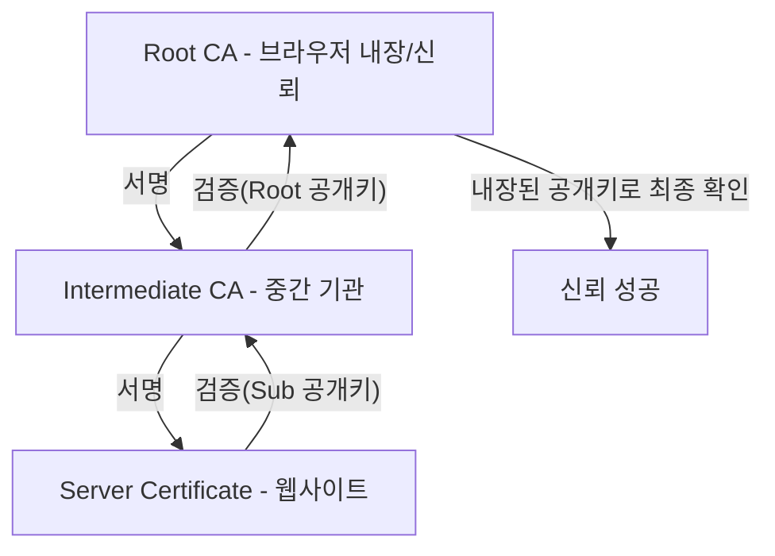

# 인증서를 통한 신뢰할 수 있는 통신 절차

인증서가 어떻게 안전한 통신을 보장하는지 단계별로 설명합니다.

---

## TLS/SSL 통신의 전체 흐름

```mermaid
sequenceDiagram
    autonumber
    participant C as 클라이언트 (브라우저)
    participant S as 서버 (웹사이트)

    C->>S: 1. ClientHello (버전, 암호화 목록, 난수)
    S->>C: 2. ServerHello + 인증서 (서버 난수, 인증서 체인)
    
    Note over C: 3. 인증서 검증 (신뢰 확인)
    Note right of C: - CA 서명, 유효기간, 도메인 등 검증
    
    C->>S: 4. 키 교환 (Premaster Secret 전송)
    Note right of C: - 서버 공개키로 암호화하여 전송
    
    Note over S: 5. 개인키로 복호화 및 대칭키 생성
    Note over C,S: 6. Finished (암호화 통신 준비 완료)
    
    C<->>S: 7. 대칭키 암호화 통신 (고속 데이터 전송)
```

---

## 단계별 상세 절차

### 1 단계: ClientHello
클라이언트가 서버에 접속을 시도하며 보내는 첫 번째 메시지입니다.

- **지원 TLS 버전:** TLS 1.2, 1.3 등
- **암호화 스위트 목록:** 지원 가능한 암호화 알고리즘 리스트
- **클라이언트 랜덤:** 키 생성에 사용될 32바이트 난수
- **확장 정보:** SNI(접속 도메인), ALPN 등

### 2 단계: ServerHello + 인증서
서버가 클라이언트의 요청에 응답하며 자신의 신원을 증명합니다.

- **ServerHello:** 선택된 TLS 버전 및 암호화 스위트, 서버 랜덤 난수
- **Certificate:** 서버의 공개키가 포함된 X.509 인증서
- **Certificate Chain:** 인증서의 정당성을 증명할 중간 CA 인증서들

### 3 단계: 인증서 검증 (신뢰 확인)
클라이언트 브라우저 내부에서 수행되는 핵심 보안 절차입니다.

| 검증 항목 | 내용 | 비고 |
|-----------|------|------|
| **CA 서명 검증** | 상위 CA의 공개키로 서버 인증서의 서명 확인 | 체인 검증 |
| **유효기간 확인** | 현재 시간이 시작일과 만료일 사이에 있는지 확인 | 만료 여부 |
| **폐기 여부 확인** | CRL 또는 OCSP를 통해 폐기된 인증서인지 조회 | 유출 여부 |
| **도메인 일치 확인** | 인증서의 CN/SAN이 실제 접속 도메인과 같은지 확인 | 피싱 방지 |
| **키 용도 확인** | 해당 인증서가 '서버 인증' 용도로 발급되었는지 확인 | 용도 제한 |

---

### 4 단계: 키 교환 (대칭키 공유)

1.  **Premaster Secret 생성:** 클라이언트가 새로운 랜덤 값(대칭키의 씨앗)을 생성합니다.
2.  **서버 공개키로 암호화:** 이 값을 서버의 인증서에 포함된 **공개키**로 암호화합니다.
3.  **전송:** 암호화된 값을 서버에 보냅니다. 중간에 해커가 가로채도 서버의 **개인키**가 없으면 내용을 알 수 없습니다.
4.  **대칭키 유도:** 양쪽은 공유된 Premaster Secret과 이전에 교환한 난수들을 조합하여 실제 통신에 쓸 **세션 키(대칭키)**를 생성합니다.

---

### 5 단계: Finished 및 암호화 통신 시작

- **Finished:** 지금까지의 핸드셰이크 과정이 올바른지 확인하고, 이제부터 생성된 대칭키로 암호화하여 통신하겠다는 신호를 주고받습니다.
- **Application Data:** 모든 준비가 완료되면 HTTP 요청/응답 등의 실제 데이터를 고속 대칭키(AES 등)로 암호화하여 주고받습니다.

---

## 신뢰 체인 검증 상세

우리가 서버 인증서를 믿을 수 있는 이유는 **'신뢰의 사슬(Chain of Trust)'** 때문입니다.



---

## 보안 속성 요약

| 보안 속성 | 설명 | 구현 방식 |
|-----------|------|-----------|
| **기밀성** | 중간자가 데이터를 읽을 수 없음 | 대칭키 암호화 (AES) |
| **무결성** | 데이터 위변조 시 즉시 감지 | 해시 기반 메시지 인증 (HMAC) |
| **인증** | 서버의 신원을 확실히 확인 | 디지털 인증서 및 서명 |
| **부인 방지** | 통신 사실을 나중에 부인할 수 없음 | 개인키 기반 디지털 서명 |

**이러한 다단계 보안 절차를 통해 우리가 매일 사용하는 웹사이트와 Kubernetes API 통신이 안전하게 보호됩니다.**
