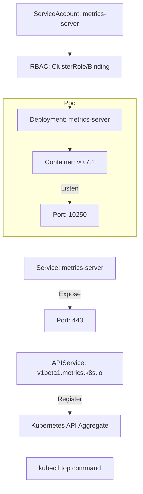

# Metric Server YAML 분석

Metric Server 설치에 사용되는 YAML 파일을 분석합니다.

## 전체 구성

```
Metric Server 구성 리소스:
1. ServiceAccount          - Pod 의 신원
2. ClusterRole (x2)        - 권한 정의
3. RoleBinding             - 네임스페이스 내 권한 바인딩
4. ClusterRoleBinding (x2) - 클러스터 전체 권한 바인딩
5. Service                 - 네트워크 엔드포인트
6. Deployment              - Pod 배포
7. APIService              - Kubernetes API 확장
```

---

## 1. ServiceAccount

```yaml
apiVersion: v1
kind: ServiceAccount
metadata:
  labels:
    k8s-app: metrics-server
  name: metrics-server
  namespace: kube-system
```

### 설명

| 필드 | 값 | 설명 |
|------|-----|------|
| `name` | metrics-server | ServiceAccount 이름 |
| `namespace` | kube-system | 시스템 컴포넌트 네임스페이스 |
| `labels` | k8s-app: metrics-server | 식별용 라벨 |

### 역할

- Metric Server Pod 가 Kubernetes API 와 통신할 때 사용하는 신원
- 이 ServiceAccount 에 연결된 RBAC 권한이 Pod 에 적용됨

---

## 2. ClusterRole - Aggregated Metrics Reader

```yaml
apiVersion: rbac.authorization.k8s.io/v1
kind: ClusterRole
metadata:
  labels:
    k8s-app: metrics-server
    rbac.authorization.k8s.io/aggregate-to-admin: "true"
    rbac.authorization.k8s.io/aggregate-to-edit: "true"
    rbac.authorization.k8s.io/aggregate-to-view: "true"
  name: system:aggregated-metrics-reader
rules:
- apiGroups:
  - metrics.k8s.io
  resources:
  - pods
  - nodes
  verbs:
  - get
  - list
  - watch
```

### 설명

| 필드 | 값 | 설명 |
|------|-----|------|
| `name` | system:aggregated-metrics-reader | 표준 이름 (시스템 예약) |
| `apiGroups` | metrics.k8s.io | 메트릭스 API 그룹 |
| `resources` | pods, nodes | 파드와 노드 메트릭 |
| `verbs` | get, list, watch | 읽기 전용 권한 |

### Aggregation 레이블

```yaml
rbac.authorization.k8s.io/aggregate-to-admin: "true"
rbac.authorization.k8s.io/aggregate-to-edit: "true"
rbac.authorization.k8s.io/aggregate-to-view: "true"
```

- 이 ClusterRole 이 admin/edit/view 역할에 자동 집계됨
- 사용자가 admin/edit/view 권한을 가지면 메트릭스도 자동으로 조회 가능

---

## 3. ClusterRole - Metrics Server

```yaml
apiVersion: rbac.authorization.k8s.io/v1
kind: ClusterRole
metadata:
  labels:
    k8s-app: metrics-server
  name: system:metrics-server
rules:
- apiGroups:
  - ""
  resources:
  - nodes/metrics
  verbs:
  - get
- apiGroups:
  - ""
  resources:
  - pods
  - nodes
  verbs:
  - get
  - list
  - watch
```

### 설명

| 리소스 | 권한 | 용도 |
|--------|------|------|
| `nodes/metrics` | get | Kubelet 에서 노드 메트릭 수집 |
| `pods` | get, list, watch | 파드 정보 조회 |
| `nodes` | get, list, watch | 노드 정보 조회 |

### 역할

- Metric Server 가 Kubelet 과 Kubernetes API 에서 데이터를 읽기 위한 권한

---

## 4. RoleBinding

```yaml
apiVersion: rbac.authorization.k8s.io/v1
kind: RoleBinding
metadata:
  labels:
    k8s-app: metrics-server
  name: metrics-server-auth-reader
  namespace: kube-system
roleRef:
  apiGroup: rbac.authorization.k8s.io
  kind: Role
  name: extension-apiserver-authentication-reader
subjects:
- kind: ServiceAccount
  name: metrics-server
  namespace: kube-system
```

### 설명

| 필드 | 값 | 설명 |
|------|-----|------|
| `roleRef.name` | extension-apiserver-authentication-reader | Kubernetes 기본 Role |
| `subjects` | metrics-server ServiceAccount | 권한을 받을 주체 |

### 역할

- API Server 확장 인증 설정을 읽을 수 있는 권한 부여
- Metric Server 가 API Server 로 등록되기 위해 필요

---

## 5. ClusterRoleBinding - Auth Delegator

```yaml
apiVersion: rbac.authorization.k8s.io/v1
kind: ClusterRoleBinding
metadata:
  labels:
    k8s-app: metrics-server
  name: metrics-server:system:auth-delegator
roleRef:
  apiGroup: rbac.authorization.k8s.io
  kind: ClusterRole
  name: system:auth-delegator
subjects:
- kind: ServiceAccount
  name: metrics-server
  namespace: kube-system
```

### 설명

| 필드 | 값 | 설명 |
|------|-----|------|
| `roleRef.name` | system:auth-delegator | Kubernetes 기본 ClusterRole |
| `subjects` | metrics-server ServiceAccount | 권한을 받을 주체 |

### 역할

- Metric Server 가 인증/인가 위임 권한을 가짐
- API Server 가 Metric Server 에 인증 검사를 위임할 수 있음

---

## 6. ClusterRoleBinding - Metrics Server

```yaml
apiVersion: rbac.authorization.k8s.io/v1
kind: ClusterRoleBinding
metadata:
  labels:
    k8s-app: metrics-server
  name: system:metrics-server
roleRef:
  apiGroup: rbac.authorization.k8s.io
  kind: ClusterRole
  name: system:metrics-server
subjects:
- kind: ServiceAccount
  name: metrics-server
  namespace: kube-system
```

### 설명

| 필드 | 값 | 설명 |
|------|-----|------|
| `roleRef.name` | system:metrics-server | 위에서 정의한 ClusterRole |
| `subjects` | metrics-server ServiceAccount | 권한을 받을 주체 |

### 역할

- 3 번에서 정의한 ClusterRole 을 ServiceAccount 에 바인딩
- Metric Server Pod 가 메트릭을 수집할 권한 부여

---

## 7. Service

```yaml
apiVersion: v1
kind: Service
metadata:
  labels:
    k8s-app: metrics-server
  name: metrics-server
  namespace: kube-system
spec:
  ports:
  - name: https
    port: 443
    protocol: TCP
    targetPort: https
  selector:
    k8s-app: metrics-server
```

### 설명

| 필드 | 값 | 설명 |
|------|-----|------|
| `port` | 443 | 서비스 포트 (HTTPS) |
| `targetPort` | https | 컨테이너 포트 (이름 참조) |
| `selector` | k8s-app: metrics-server | 대상 Pod 선택 |

### 역할

- Metric Server 에 대한 네트워크 엔드포인트 제공
- API Server 가 메트릭을 조회할 때 사용

---

## 8. Deployment

```yaml
apiVersion: apps/v1
kind: Deployment
metadata:
  labels:
    k8s-app: metrics-server
  name: metrics-server
  namespace: kube-system
spec:
  selector:
    matchLabels:
      k8s-app: metrics-server
  strategy:
    rollingUpdate:
      maxUnavailable: 0
  template:
    metadata:
      labels:
        k8s-app: metrics-server
    spec:
      containers:
      - args:
        - --cert-dir=/tmp
        - --secure-port=10250
        - --kubelet-preferred-address-types=InternalIP,ExternalIP,Hostname
        - --kubelet-use-node-status-port
        - --metric-resolution=15s
        - --kubelet-insecure-tls
        image: registry.k8s.io/metrics-server/metrics-server:v0.7.1
        imagePullPolicy: IfNotPresent
        name: metrics-server
        ports:
        - containerPort: 10250
          name: https
          protocol: TCP
        livenessProbe:
          failureThreshold: 3
          httpGet:
            path: /livez
            port: https
            scheme: HTTPS
          periodSeconds: 10
        readinessProbe:
          failureThreshold: 3
          httpGet:
            path: /readyz
            port: https
            scheme: HTTPS
          initialDelaySeconds: 20
          periodSeconds: 10
        resources:
          requests:
            cpu: 100m
            memory: 200Mi
        securityContext:
          allowPrivilegeEscalation: false
          capabilities:
            drop:
            - ALL
          readOnlyRootFilesystem: true
          runAsNonRoot: true
          runAsUser: 1000
          seccompProfile:
            type: RuntimeDefault
        volumeMounts:
        - mountPath: /tmp
          name: tmp-dir
      nodeSelector:
        kubernetes.io/os: linux
      priorityClassName: system-cluster-critical
      serviceAccountName: metrics-server
      volumes:
      - emptyDir: {}
        name: tmp-dir
```

### 컨테이너 인수 (args)

| 인수 | 설명 |
|------|------|
| `--cert-dir=/tmp` | 인증서 저장 디렉토리 |
| `--secure-port=10250` | 보안 포트 |
| `--kubelet-preferred-address-types=InternalIP,ExternalIP,Hostname` | Kubelet 접속 주소 우선순위 |
| `--kubelet-use-node-status-port` | 노드 상태 포트 사용 |
| `--metric-resolution=15s` | 메트릭 수집 주기 (15 초) |
| `--kubelet-insecure-tls` | Kubelet TLS 검증 비활성화 (테스트용) |

### 프로브 (Probe)

```yaml
livenessProbe:
  httpGet:
    path: /livez      # 생존 체크 엔드포인트
    port: https
    scheme: HTTPS
  periodSeconds: 10   # 10 초마다 확인

readinessProbe:
  httpGet:
    path: /readyz     # 준비 상태 체크 엔드포인트
    port: https
    scheme: HTTPS
  initialDelaySeconds: 20  # 시작 후 20 초 후 첫 확인
  periodSeconds: 10        # 10 초마다 확인
```

### 보안 컨텍스트

```yaml
securityContext:
  allowPrivilegeEscalation: false  # 권한 상승 불가
  capabilities:
    drop:
    - ALL                          # 모든 Linux capability 제거
  readOnlyRootFilesystem: true     # 루트 파일시스템 읽기 전용
  runAsNonRoot: true               # 루트 사용자 불가
  runAsUser: 1000                  # UID 1000 으로 실행
  seccompProfile:
    type: RuntimeDefault           # 기본 seccomp 프로파일 사용
```

### 리소스 요청

```yaml
resources:
  requests:
    cpu: 100m      # 0.1 코어 보장
    memory: 200Mi  # 200MB 보장
```

### 기타 중요 설정

```yaml
priorityClassName: system-cluster-critical  # 높은 우선순위
nodeSelector:
  kubernetes.io/os: linux                   # Linux 노드만
serviceAccountName: metrics-server          # ServiceAccount 사용
```

---

## 9. APIService

```yaml
apiVersion: apiregistration.k8s.io/v1
kind: APIService
metadata:
  labels:
    k8s-app: metrics-server
  name: v1beta1.metrics.k8s.io
spec:
  group: metrics.k8s.io
  groupPriorityMinimum: 100
  insecureSkipTLSVerify: true
  service:
    name: metrics-server
    namespace: kube-system
  version: v1beta1
  versionPriority: 100
```

### 설명

| 필드 | 값 | 설명 |
|------|-----|------|
| `name` | v1beta1.metrics.k8s.io | API 서비스 이름 |
| `group` | metrics.k8s.io | API 그룹 |
| `version` | v1beta1 | API 버전 |
| `service.name` | metrics-server | 연결할 서비스 |
| `service.namespace` | kube-system | 서비스 네임스페이스 |

### 역할

- Kubernetes API 를 확장하여 `metrics.k8s.io` 그룹 추가
- `kubectl top` 명령어가 이 API 를 사용

### API 엔드포인트

```bash
# Metric Server 가 등록하는 API
/apis/metrics.k8s.io/v1beta1/nodes
/apis/metrics.k8s.io/v1beta1/pods

# kubectl top 이 이 API 를 호출
kubectl top nodes
# → GET /apis/metrics.k8s.io/v1beta1/nodes

kubectl top pods
# → GET /apis/metrics.k8s.io/v1beta1/pods
```

---

## 리소스 관계도

Metric Server를 구성하는 주요 리소스들의 연결 구조입니다.



| 리소스 유형 | 이름 | 주요 역할 |
|-----------|------|----------|
| **RBAC** | `system:metrics-server` | API 집계 및 리소스 조회를 위한 권한 부여 |
| **Deployment** | `metrics-server` | 실제 메트릭 수집 및 처리 데몬 실행 |
| **Service** | `metrics-server` | API 서버가 메트릭 서버에 접근하기 위한 통로 |
| **APIService** | `v1beta1.metrics.k8s.io` | 표준 API 서버에 메트릭 기능을 등록 |

---

## 설치 확인

```bash
# Metric Server 설치
kubectl apply -f components.yaml

# Pod 상태 확인
kubectl get pods -n kube-system -l k8s-app=metrics-server
# NAME                            READY   STATUS    RESTARTS   AGE
# metrics-server-xxxxxxxxxx-xxx   1/1     Running   0          1m

# API 서비스 등록 확인
kubectl get apiservice v1beta1.metrics.k8s.io
# NAME                     SERVICE                      AVAILABLE   AGE
# v1beta1.metrics.k8s.io   kube-system/metrics-server   True        1m

# 메트릭 조회 테스트
kubectl top nodes
kubectl top pods
```

---

## 요약

| 리소스 | 개수 | 용도 |
|--------|------|------|
| ServiceAccount | 1 | Pod 신원 |
| ClusterRole | 2 | 권한 정의 |
| RoleBinding | 1 | 네임스페이스 권한 |
| ClusterRoleBinding | 2 | 클러스터 권한 |
| Service | 1 | 네트워크 엔드포인트 |
| Deployment | 1 | Pod 배포 |
| APIService | 1 | API 확장 |
| **총계** | **9** | |

**Metric Server 는 Kubernetes API 를 확장하여 메트릭 조회 기능을 추가하는 시스템 컴포넌트입니다.**
