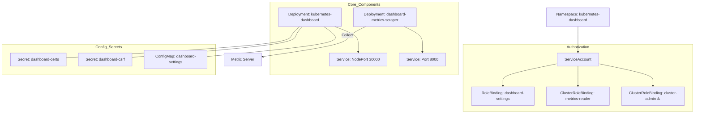

# Kubernetes Dashboard YAML 분석

Kubernetes Dashboard 설치에 사용되는 YAML 파일을 분석합니다.

## 전체 구성

```
Dashboard 구성 리소스:
1. Namespace                 - 전용 네임스페이스
2. ServiceAccount            - Pod 의 신원
3. Service (x2)              - 네트워크 엔드포인트
4. Secret (x3)               - 인증서 및 CSRF 토큰
5. ConfigMap                 - 설정 저장
6. Role                      - 네임스페이스 권한
7. ClusterRole               - 클러스터 권한
8. RoleBinding               - 네임스페이스 권한 바인딩
9. ClusterRoleBinding (x2)   - 클러스터 권한 바인딩
10. Deployment (x2)          - Pod 배포
```

---

## 1. Namespace

```yaml
apiVersion: v1
kind: Namespace
metadata:
  name: kubernetes-dashboard
```

### 설명

| 필드 | 값 | 설명 |
|------|-----|------|
| `name` | kubernetes-dashboard | Dashboard 전용 네임스페이스 |

### 역할

- Dashboard 관련 리소스를 격리
- 시스템 네임스페이스 (kube-system) 와 분리

---

## 2. ServiceAccount

```yaml
apiVersion: v1
kind: ServiceAccount
metadata:
  labels:
    k8s-app: kubernetes-dashboard
  name: kubernetes-dashboard
  namespace: kubernetes-dashboard
```

### 설명

| 필드 | 값 | 설명 |
|------|-----|------|
| `name` | kubernetes-dashboard | ServiceAccount 이름 |
| `namespace` | kubernetes-dashboard | Dashboard 네임스페이스 |

### 역할

- Dashboard Pod 가 Kubernetes API 와 통신할 때 사용하는 신원

---

## 3. Service - Dashboard

```yaml
kind: Service
apiVersion: v1
metadata:
  labels:
    k8s-app: kubernetes-dashboard
  name: kubernetes-dashboard
  namespace: kubernetes-dashboard
spec:
  ports:
    - port: 443
      targetPort: 8443
      nodePort: 30000
  selector:
    k8s-app: kubernetes-dashboard
  type: NodePort
```

### 설명

| 필드 | 값 | 설명 |
|------|-----|------|
| `port` | 443 | 서비스 포트 (HTTPS) |
| `targetPort` | 8443 | 컨테이너 포트 |
| `nodePort` | 30000 | 노드에서 노출되는 포트 |
| `type` | NodePort | 노드 포트를 통한 외부 접근 |

### 접속 URL

```
https://<노드 IP>:30000
```

---

## 4. Secret (x3)

### 4-1. 인증서 저장소

```yaml
apiVersion: v1
kind: Secret
metadata:
  labels:
    k8s-app: kubernetes-dashboard
  name: kubernetes-dashboard-certs
  namespace: kubernetes-dashboard
type: Opaque
```

### 역할

- Dashboard HTTPS 인증서 저장

### 4-2. CSRF 토큰

```yaml
apiVersion: v1
kind: Secret
metadata:
  labels:
    k8s-app: kubernetes-dashboard
  name: kubernetes-dashboard-csrf
  namespace: kubernetes-dashboard
type: Opaque
data:
  csrf: ""
```

### 역할

- Cross-Site Request Forgery 공격 방지 토큰

### 4-3. 키 보관소

```yaml
apiVersion: v1
kind: Secret
metadata:
  labels:
    k8s-app: kubernetes-dashboard
  name: kubernetes-dashboard-key-holder
  namespace: kubernetes-dashboard
type: Opaque
```

### 역할

- 암호화 키 보관

---

## 5. ConfigMap

```yaml
kind: ConfigMap
apiVersion: v1
metadata:
  labels:
    k8s-app: kubernetes-dashboard
  name: kubernetes-dashboard-settings
  namespace: kubernetes-dashboard
```

### 역할

- Dashboard 설정 저장
- 사용자 설정, 클러스터 정보 등

---

## 6. Role

```yaml
kind: Role
apiVersion: rbac.authorization.k8s.io/v1
metadata:
  labels:
    k8s-app: kubernetes-dashboard
  name: kubernetes-dashboard
  namespace: kubernetes-dashboard
rules:
  # Dashboard 전용 Secret 관리
  - apiGroups: [""]
    resources: ["secrets"]
    resourceNames: ["kubernetes-dashboard-key-holder", 
                    "kubernetes-dashboard-certs", 
                    "kubernetes-dashboard-csrf"]
    verbs: ["get", "update", "delete"]
    
  # 설정 ConfigMap 관리
  - apiGroups: [""]
    resources: ["configmaps"]
    resourceNames: ["kubernetes-dashboard-settings"]
    verbs: ["get", "update"]
    
  # 메트릭 서비스 프록시
  - apiGroups: [""]
    resources: ["services"]
    resourceNames: ["heapster", "dashboard-metrics-scraper"]
    verbs: ["proxy"]
  - apiGroups: [""]
    resources: ["services/proxy"]
    resourceNames: ["heapster", "http:heapster:", 
                    "https:heapster:", 
                    "dashboard-metrics-scraper", 
                    "http:dashboard-metrics-scraper"]
    verbs: ["get"]
```

### 권한 요약

| 리소스 | 리소스 이름 | 권한 |
|--------|-------------|------|
| Secrets | dashboard 관련 3 개 | get, update, delete |
| ConfigMaps | settings | get, update |
| Services | heapster, metrics-scraper | proxy |
| Services/Proxy | heapster, metrics-scraper | get |

---

## 7. ClusterRole

```yaml
kind: ClusterRole
apiVersion: rbac.authorization.k8s.io/v1
metadata:
  labels:
    k8s-app: kubernetes-dashboard
  name: kubernetes-dashboard
rules:
  # Metrics Server 에서 메트릭 조회
  - apiGroups: ["metrics.k8s.io"]
    resources: ["pods", "nodes"]
    verbs: ["get", "list", "watch"]
```

### 역할

- 클러스터 전체의 메트릭 조회 권한
- `kubectl top` 과 동일한 메트릭 데이터 접근

---

## 8. RoleBinding

```yaml
apiVersion: rbac.authorization.k8s.io/v1
kind: RoleBinding
metadata:
  labels:
    k8s-app: kubernetes-dashboard
  name: kubernetes-dashboard
  namespace: kubernetes-dashboard
roleRef:
  apiGroup: rbac.authorization.k8s.io
  kind: Role
  name: kubernetes-dashboard
subjects:
  - kind: ServiceAccount
    name: kubernetes-dashboard
    namespace: kubernetes-dashboard
```

### 역할

- Role 의 권한을 ServiceAccount 에 바인딩

---

## 9. ClusterRoleBinding (x2)

### 9-1. 메트릭 조회 권한

```yaml
apiVersion: rbac.authorization.k8s.io/v1
kind: ClusterRoleBinding
metadata:
  name: kubernetes-dashboard
roleRef:
  apiGroup: rbac.authorization.k8s.io
  kind: ClusterRole
  name: kubernetes-dashboard
subjects:
  - kind: ServiceAccount
    name: kubernetes-dashboard
    namespace: kubernetes-dashboard
```

### 역할

- ClusterRole 의 메트릭 조회 권한 바인딩

### 9-2. 관리자 권한 (중요!)

```yaml
apiVersion: rbac.authorization.k8s.io/v1
kind: ClusterRoleBinding
metadata:
  name: kubernetes-dashboard2
  labels:
    k8s-app: kubernetes-dashboard
roleRef:
  apiGroup: rbac.authorization.k8s.io
  kind: ClusterRole
  name: cluster-admin
subjects:
- kind: ServiceAccount
  name: kubernetes-dashboard
  namespace: kubernetes-dashboard
```

### ⚠️ 주의사항

| 항목 | 설명 |
|------|------|
| `roleRef.name` | cluster-admin |
| **권한** | **클러스터 전체 관리자 권한** |
| **위험도** | **높음** |

**이 ClusterRoleBinding 은 Dashboard 에 cluster-admin 권한을 부여합니다.**

### 보안 고려사항

```
⚠️ 위험 요소:
1. Dashboard 를 통한 클러스터 완전 제어 가능
2. Dashboard 가 침해되면 클러스터 전체 침해
3. 외부 노출 시 심각한 보안 문제

✅ 권장 사항:
1. NodePort 대신 Ingress 사용
2. 인증/인가 강화
3. 네트워크 폴리시 적용
4. cluster-admin 대신 최소 권한 원칙 적용
```

---

## 10. Deployment - Dashboard

```yaml
kind: Deployment
apiVersion: apps/v1
metadata:
  labels:
    k8s-app: kubernetes-dashboard
  name: kubernetes-dashboard
  namespace: kubernetes-dashboard
spec:
  replicas: 1
  revisionHistoryLimit: 10
  selector:
    matchLabels:
      k8s-app: kubernetes-dashboard
  template:
    metadata:
      labels:
        k8s-app: kubernetes-dashboard
    spec:
      securityContext:
        seccompProfile:
          type: RuntimeDefault
      containers:
        - name: kubernetes-dashboard
          image: kubernetesui/dashboard:v2.7.0
          imagePullPolicy: Always
          ports:
            - containerPort: 8443
              protocol: TCP
          args:
            - --auto-generate-certificates
            - --namespace=kubernetes-dashboard
            - --enable-skip-login
          volumeMounts:
            - name: kubernetes-dashboard-certs
              mountPath: /certs
            - mountPath: /tmp
              name: tmp-volume
          livenessProbe:
            httpGet:
              scheme: HTTPS
              path: /
              port: 8443
            initialDelaySeconds: 30
            timeoutSeconds: 30
          securityContext:
            allowPrivilegeEscalation: false
            readOnlyRootFilesystem: true
            runAsUser: 1001
            runAsGroup: 2001
      volumes:
        - name: kubernetes-dashboard-certs
          secret:
            secretName: kubernetes-dashboard-certs
        - name: tmp-volume
          emptyDir: {}
      serviceAccountName: kubernetes-dashboard
      nodeSelector:
        "kubernetes.io/os": linux
      tolerations:
        - key: node-role.kubernetes.io/master
          effect: NoSchedule
```

### 컨테이너 인수 (args)

| 인수 | 설명 |
|------|------|
| `--auto-generate-certificates` | 자동 인증서 생성 |
| `--namespace=kubernetes-dashboard` | 대상 네임스페이스 |
| `--enable-skip-login` | 로그인 건너뛰기 버튼 표시 |

### 프로브

```yaml
livenessProbe:
  httpGet:
    scheme: HTTPS
    path: /         # 루트 경로
    port: 8443
  initialDelaySeconds: 30  # 30 초 후 첫 확인
  timeoutSeconds: 30       # 30 초 타임아웃
```

### 보안 컨텍스트

```yaml
securityContext:
  allowPrivilegeEscalation: false  # 권한 상승 불가
  readOnlyRootFilesystem: true     # 루트 파일시스템 읽기 전용
  runAsUser: 1001                  # UID 1001
  runAsGroup: 2001                 # GID 2001
```

### 볼륨

```yaml
volumes:
  - name: kubernetes-dashboard-certs
    secret:
      secretName: kubernetes-dashboard-certs  # 인증서
  - name: tmp-volume
    emptyDir: {}                              # 임시 디렉토리
```

---

## 11. Service - Metrics Scraper

```yaml
kind: Service
apiVersion: v1
metadata:
  labels:
    k8s-app: dashboard-metrics-scraper
  name: dashboard-metrics-scraper
  namespace: kubernetes-dashboard
spec:
  ports:
    - port: 8000
      targetPort: 8000
  selector:
    k8s-app: dashboard-metrics-scraper
```

### 역할

- Metrics Scraper 에 대한 내부 서비스 엔드포인트

---

## 12. Deployment - Metrics Scraper

```yaml
kind: Deployment
apiVersion: apps/v1
metadata:
  labels:
    k8s-app: dashboard-metrics-scraper
  name: dashboard-metrics-scraper
  namespace: kubernetes-dashboard
spec:
  replicas: 1
  selector:
    matchLabels:
      k8s-app: dashboard-metrics-scraper
  template:
    metadata:
      labels:
        k8s-app: dashboard-metrics-scraper
    spec:
      containers:
        - name: dashboard-metrics-scraper
          image: kubernetesui/metrics-scraper:v1.0.8
          ports:
            - containerPort: 8000
              protocol: TCP
          livenessProbe:
            httpGet:
              scheme: HTTP
              path: /
              port: 8000
            initialDelaySeconds: 30
            timeoutSeconds: 30
          securityContext:
            allowPrivilegeEscalation: false
            readOnlyRootFilesystem: true
            runAsUser: 1001
            runAsGroup: 2001
      serviceAccountName: kubernetes-dashboard
      volumes:
        - name: tmp-volume
          emptyDir: {}
```

### 역할

- Metric Server 에서 메트릭 데이터를 가져와 Dashboard 에 제공
- 메트릭 데이터 캐싱 및 가공

---

## Dashboard 관리자 사용자 생성

```yaml
# dashboard-adminuser.yaml
apiVersion: v1
kind: ServiceAccount
metadata:
  name: admin-user
  namespace: kubernetes-dashboard
---
apiVersion: rbac.authorization.k8s.io/v1
kind: ClusterRoleBinding
metadata:
  name: admin-user
roleRef:
  apiGroup: rbac.authorization.k8s.io
  kind: ClusterRole
  name: cluster-admin
subjects:
- kind: ServiceAccount
  name: admin-user
  namespace: kubernetes-dashboard
```

### 토큰 발급

```bash
# 토큰 생성
kubectl -n kubernetes-dashboard create token admin-user

# 출력된 토큰을 Dashboard 로그인에 사용
```

---

## 리소스 관계도

Kubernetes Dashboard를 구성하는 주요 리소스들의 구조입니다.



| 구성 요소 | 주요 역할 |
|-----------|----------|
| **Dashboard UI** | 웹 기반의 클러스터 관리 인터페이스 제공 |
| **Metrics Scraper** | Metric Server로부터 데이터를 가져와 차트용 데이터 가공 |
| **ServiceAccount** | 대시보드 프로세스가 API 서버에 접근하기 위한 신분증 |
| **Secrets** | HTTPS 통신을 위한 인증서 및 보안 토큰(CSRF) 저장 |

---

## 설치 확인

```bash
# Dashboard 설치
kubectl apply -f kubernetes-dashboard.yaml
kubectl apply -f dashboard-adminuser.yaml

# Pod 상태 확인
kubectl get pods -n kubernetes-dashboard
# NAME                                  READY   STATUS    RESTARTS   AGE
# kubernetes-dashboard-xxxxxxxxx-xxxx   1/1     Running   0          1m
# dashboard-metrics-scraper-xxxx-xxx    1/1     Running   0          1m

# Service 상태 확인
kubectl get svc -n kubernetes-dashboard
# NAME                        TYPE       CLUSTER-IP     EXTERNAL-IP   PORT(S)          AGE
# kubernetes-dashboard        NodePort   10.96.xxx.xxx  <none>        443:30000/TCP    1m
# dashboard-metrics-scraper   ClusterIP  10.96.xxx.xxx  <none>        8000/TCP         1m

# 토큰 발급
kubectl -n kubernetes-dashboard create token admin-user

# 접속
# https://<노드 IP>:30000
```

---

## 요약

| 리소스 | 개수 | 용도 |
|--------|------|------|
| Namespace | 1 | 전용 네임스페이스 |
| ServiceAccount | 1 | Pod 신원 |
| Service | 2 | 네트워크 엔드포인트 |
| Secret | 3 | 인증서, CSRF, 키 |
| ConfigMap | 1 | 설정 저장 |
| Role | 1 | 네임스페이스 권한 |
| ClusterRole | 1 | 클러스터 권한 |
| RoleBinding | 1 | 네임스페이스 바인딩 |
| ClusterRoleBinding | 2 | 클러스터 바인딩 |
| Deployment | 2 | Pod 배포 |
| **총계** | **15** | |

**Kubernetes Dashboard 는 웹 기반 UI 를 제공하며, cluster-admin 권한 부여 시 보안 주의가 필요합니다.**
