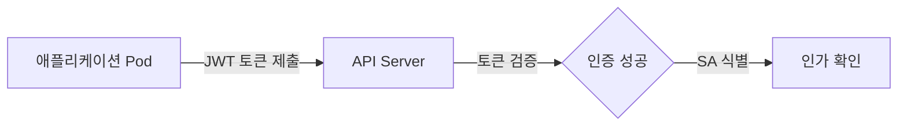

# Kubernetes 에서 Machine User 와 Human User

Kubernetes 에서 사용자(User)는 Human User(사람)와 Machine User(기계/서비스)로 구분됩니다.

---

## 핵심 개념 비교

| 구분 | Human User (사람) | Machine User (기계/서비스) |
|------|-------------------|--------------------------|
| **주체** | 개발자, 관리자, 운영팀 등 | 애플리케이션, CI/CD, 모니터링 봇 등 |
| **인증 방식** | X.509 인증서, OIDC 토큰 | ServiceAccount 토큰 (JWT) |
| **식별자** | CN (예: admin, john) | `system:serviceaccount:<ns>:<name>` |
| **그룹** | O (예: developers, admins) | `system:serviceaccounts` |
| **수명** | 장기 (1년+) 또는 OIDC (1시간) | 단기 (자동 회전), Pod 수명과 연동 |
| **사용 사례** | kubectl 명령, 수동 관리 작업 | Pod 내부 API 호출, 자동화 스크립트 |

---

## 사용자 유형별 특징

### 1. Human User (사람 사용자)

사람 사용자는 클러스터 외부에서 `kubectl`과 같은 도구를 통해 접속하는 실제 사용자를 의미합니다. Kubernetes는 자체적으로 '사용자' 리소스를 관리하지 않으므로, 외부 신원 증명을 통해 사용자를 식별합니다.

- **인증서 기반:** 클라이언트 인증서의 Common Name(CN) 필드를 사용자 이름으로 인식합니다.
- **OIDC 기반:** Google, Okta 등의 외부 인증 제공자로부터 받은 토큰 내의 이메일이나 ID를 사용자로 인식합니다.

### 2. Machine User (ServiceAccount)

기계 사용자는 클러스터 내부의 Pod나 자동화 도구가 API 서버와 통신할 때 사용하는 계정입니다. Kubernetes 리소스(`ServiceAccount`)로 관리되므로 생성과 삭제가 자유롭습니다.

- **자동 생성:** 네임스페이스마다 `default`라는 이름의 ServiceAccount가 자동으로 생성됩니다.
- **자동 마운트:** Pod 생성 시 특정 ServiceAccount를 지정하면 관련 토큰이 Pod 내부 `/var/run/secrets/kubernetes.io/serviceaccount/` 경로에 자동으로 마운트됩니다.

---

## 보안 고려사항

| 사용자 유형 | 보안 위협 | 대응 방안 |
|-------------|-----------|-----------|
| **Human User** | 개인키/토큰 유출 | MFA(다중 인증) 사용, 짧은 만료 시간의 OIDC 토큰 권장 |
| **Machine User** | Pod 탈취 시 권한 남용 | 최소 권한 원칙(Least Privilege) 적용, 불필요한 자동 마운트 비활성화 |

**두 사용자 유형의 차이를 이해하고 적절한 인증 방식을 선택하는 것이 클러스터 보안의 핵심입니다.**
