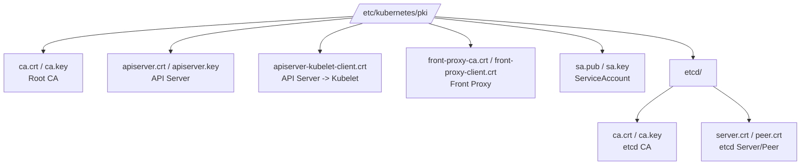

# Kubernetes 인증서 보관 위치

Kubernetes 클러스터에서 인증서가 저장되는 위치와 관리 방법을 알아봅니다.

---

## 인증서 저장 위치 개요

Kubernetes의 구성 요소들은 역할에 따라 서로 다른 위치에 인증서를 보관합니다.

| 위치 | 경로 | 설명 |
|------|------|------|
| **Control Plane** | `/etc/kubernetes/pki/` | 마스터 노드의 핵심 인증서 보관 |
| **Worker Node** | `/var/lib/kubelet/pki/` | kubelet용 클라이언트 인증서 보관 |
| **etcd** | `/etc/kubernetes/pki/etcd/` | etcd 데이터베이스 보안을 위한 전용 인증서 |
| **사용자** | `~/.kube/config` | kubectl 접속을 위한 인증 정보가 포함된 파일 |
| **Pod** | `/var/run/secrets/kubernetes.io/serviceaccount/` | ServiceAccount 토큰 및 CA 인증서 |

---

## 1. 마스터 노드 인증서 상세 (`/etc/kubernetes/pki/`)

kubeadm으로 생성된 클러스터의 마스터 노드에는 다음과 같은 인증서 구조가 형성됩니다.



### 주요 파일의 용도

| 파일명 | 용도 | 중요도 |
|--------|------|--------|
| **ca.crt / ca.key** | 클러스터 전체의 신뢰 기점 (Root CA) | **최상 (절대 유출 금지)** |
| **apiserver.crt / .key** | API 서버의 서버 인증서 | 상 |
| **sa.pub / .key** | ServiceAccount 토큰 서명용 키 쌍 | 상 |
| **etcd/ca.crt / .key** | etcd 클러스터 보안용 별도 CA | 상 |

---

## 2. 노드별 kubeconfig 파일 (`/etc/kubernetes/`)

컴포넌트들이 API 서버에 접속하기 위한 설정 파일(kubeconfig)들도 마스터 노드에 저장됩니다. 이 파일들 내부에는 인증서 정보가 Base64로 인코딩되어 포함되어 있습니다.

- **admin.conf:** 클러스터 관리자용 (kubectl용)
- **kubelet.conf:** kubelet이 API 서버에 접속할 때 사용
- **controller-manager.conf:** controller-manager용
- **scheduler.conf:** scheduler용

---

## 3. 워커 노드 인증서 (`/var/lib/kubelet/pki/`)

워커 노드에서는 kubelet이 API 서버와 안전하게 통신하기 위해 다음 파일들을 관리합니다.

- **kubelet.crt / .key:** kubelet이 API 서버에 자신을 증명할 때 사용하는 인증서
- **ca.crt:** API 서버의 인증서를 검증하기 위해 사용하는 Root CA 공개키

---

## 인증서 확인 팁

리눅스 시스템에서 특정 인증서 파일의 내용을 확인하려면 `openssl` 명령어를 사용합니다.

```bash
# 인증서의 주체(Subject)와 만료일 확인
openssl x509 -in /etc/kubernetes/pki/apiserver.crt -text -noout | grep -E "Subject:|Not After"
```

**인증서 저장 위치를 정확히 알면 트러블슈팅 시 인증서 만료나 권한 문제를 빠르게 해결할 수 있습니다.**
