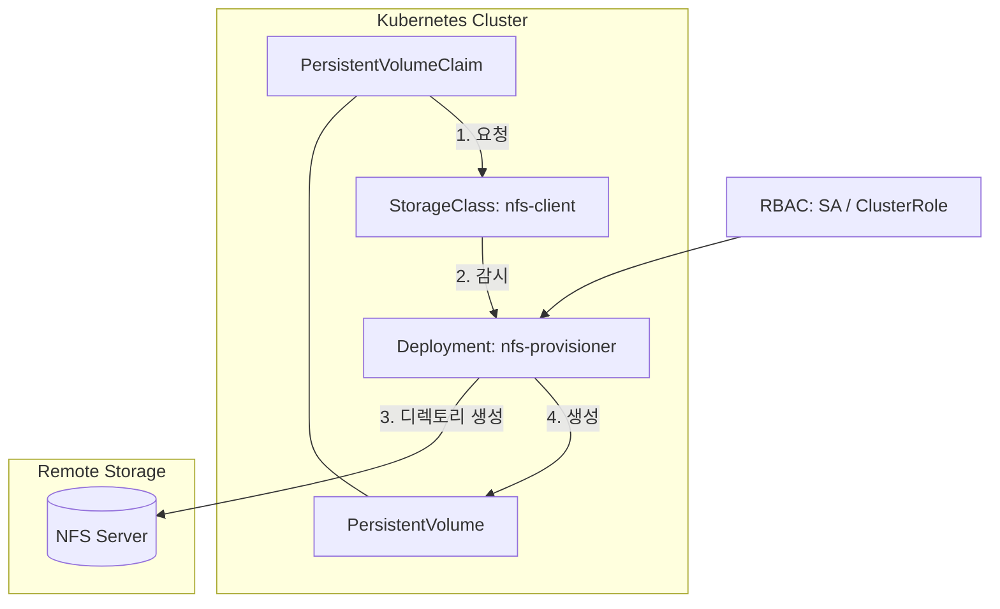
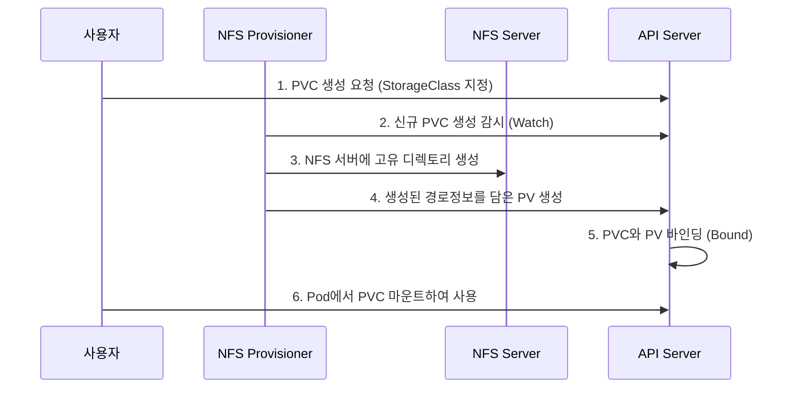

# NFS Subdir External Provisioner 설정 가이드

NFS 서버를 사용하여 Kubernetes에서 동적 볼륨 프로비저닝(Dynamic Provisioning)을 구현하는 방법을 알아봅니다.

---

## 1. 리소스 관계도

NFS 프로비저너를 구성하는 주요 컴포넌트 간의 상호작용입니다.

### 주요 리소스 역할

| 구성 요소 | 역할 | 비고 |
|-----------|------|------|
| **StorageClass** | 어떤 프로비저너를 사용할지 정의 | `archiveOnDelete` 등 정책 설정 |
| **NFS Provisioner** | PVC를 감시하고 NFS 서버에 실제 디렉토리를 생성하는 대리인 | Deployment로 실행 |
| **RBAC** | 프로비저너가 클러스터의 PV/PVC를 제어할 수 있는 권한 | SA, ClusterRole 등 |
| **NFS Server** | 실제 데이터가 저장되는 외부 서버 | IP 및 마운트 경로 필요 |

---

## 2. 동적 프로비저닝 워크플로우

사용자가 PVC를 생성했을 때 내부에서 일어나는 과정입니다.

---

## 3. 설치 확인 및 테스트 요약

1.  **프로비저너 상태 확인:** `kubectl get pods -n nfs` 명령어로 컨테이너가 `Running`인지 확인합니다.
2.  **PVC 생성:** 테스트용 `test-claim.yaml`을 적용합니다.
3.  **바인딩 확인:** `kubectl get pvc` 결과가 `Bound` 상태가 되면 성공입니다.
4.  **물리적 확인:** NFS 서버의 공유 디렉토리에 `default-test-claim-pvc-xxx` 형태의 폴더가 생성되었는지 확인합니다.

---

## 4. 요약

NFS Subdir External Provisioner를 사용하면 사용자가 수동으로 PV를 만들 필요 없이, **PVC 생성만으로 NFS 서버의 하위 디렉토리를 자동 할당**받아 사용할 수 있어 운영 효율성이 극대화됩니다.
