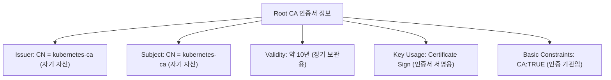

# 인증서 정보 확인 (1/2) - Root CA 와 API Server

Kubernetes 클러스터의 Root CA 인증서와 API Server에서 사용하는 인증서 파일 정보를 확인합니다.

---

## 인증서 확인 개요

클러스터 운영 중에 인증서의 유효성이나 신뢰 관계를 확인하는 것은 매우 중요합니다.

| 확인 대상 | 파일 경로 | 주요 역할 |
|-----------|-----------|-----------|
| **Root CA** | `/etc/kubernetes/pki/ca.crt` | 클러스터 신뢰의 기점 (모든 인증서의 부모) |
| **API Server** | `/etc/kubernetes/pki/apiserver.crt` | API 서버의 신원을 증명하는 서버 인증서 |

---

## 1. Root CA 인증서 정보 확인

Root CA 인증서는 자기 자신을 증명하는 **Self-Signed** 구조를 가집니다.

### 상세 정보 확인 명령어
```bash
openssl x509 -in /etc/kubernetes/pki/ca.crt -text -noout
```

### 주요 필드 분석



---

## 2. API Server 인증서 정보 확인

API Server 인증서는 Root CA에 의해 서명된 **하위 인증서**입니다.

### 상세 정보 확인 명령어
```bash
openssl x509 -in /etc/kubernetes/pki/apiserver.crt -text -noout
```

### 주요 필드 분석

| 필드명 | 내용 | 설명 |
|--------|------|------|
| **Issuer** | `CN = kubernetes-ca` | Root CA에 의해 발급됨을 증명 |
| **Subject** | `CN = kube-apiserver` | 인증서의 소유자가 API 서버임을 명시 |
| **Validity** | 약 1년 | 보안을 위해 Root CA보다 짧은 주기 |
| **SAN** | `DNS:kubernetes, IP:10.96.0.1...` | 접속 가능한 추가 도메인 및 IP 목록 |

---

## 3. 인증서 간의 신뢰 관계 확인

API 서버 인증서가 Root CA에 의해 올바르게 서명되었는지 검증하는 방법입니다.

```bash
# 서명 검증 명령어
openssl verify -CAfile /etc/kubernetes/pki/ca.crt /etc/kubernetes/pki/apiserver.crt

# 출력 결과
# /etc/kubernetes/pki/apiserver.crt: OK
```

**인증서 정보를 직접 확인하고 검증하는 능력은 클러스터의 보안 상태를 점검하고 인증 관련 장애를 해결하는 데 필수적입니다.**
