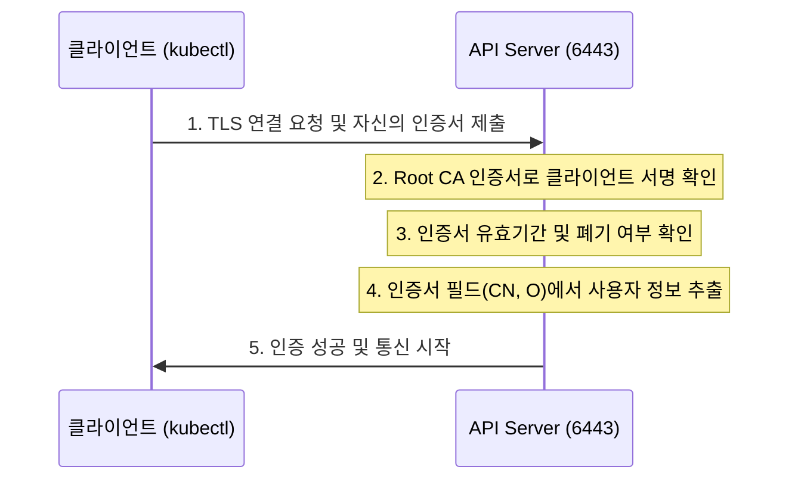

# Kubernetes API Server 인증서 접속 방식

Kubernetes API Server 에 안전하게 접속하기 위한 X.509 인증서 기반 인증 방식을 설명합니다.

---

## API Server 인증 개요

API 서버로 들어오는 모든 요청은 다음의 3단계를 거칩니다.

| 단계 | 역할 | 비고 |
|------|------|------|
| **1. 인증 (Authentication)** | "누구인가?" (Who are you?) | 신원 확인 |
| **2. 인가 (Authorization)** | "무엇을 할 수 있는가?" (What can you do?) | 권한 부여 (RBAC 등) |
| **3. Admission Control** | "요구가 적절한가?" (Is the request valid?) | 추가 검증 및 수정 |

---

## 클라이언트 인증서 인증 (X.509 Client Certs)

클라이언트 인증서 방식은 Kubernetes의 기본이자 가장 강력한 인증 수단 중 하나입니다.

### 동작 원리 (mTLS 흐름)

### 인증서 내 주요 필드와 역할

Kubernetes는 인증서의 특정 필드를 바탕으로 사용자의 신원을 파악합니다.

| 필드명 | 의미 | Kubernetes 매핑 | 예시 |
|--------|------|-----------------|------|
| **CN (Common Name)** | 공통 이름 | **User Name (사용자명)** | `admin`, `john-doe` |
| **O (Organization)** | 조직 이름 | **Group (그룹명)** | `system:masters`, `developers` |

> **주의:** Kubernetes는 내부적으로 'User' 리소스를 저장하지 않습니다. 오직 인증서에 기입된 **CN** 정보를 믿고 사용자로 인식합니다.

---

## 주요 인증서 구성 요소

- **ca.crt:** 클라이언트 인증서가 진짜인지 검증하기 위해 API 서버가 가지고 있는 Root CA 공개키
- **client.crt:** 사용자가 API 서버에 제출하는 자신의 신분증(공개키 + 서명)
- **client.key:** 사용자가 자신임을 증명하기 위해 안전하게 보관해야 하는 비밀키

---

## 장단점 요약

| 장점 | 단점 |
|------|------|
| - 매우 강력한 보안 (비대칭키 기반) | - 한 번 발급된 인증서의 폐기(Revocation)가 어려움 |
| - 오프라인 상태에서도 인증 가능 (CA 공개키만 있으면 됨) | - 유효기간 만료 시 수동 갱신 필요 |
| - 별도의 사용자 DB가 필요 없음 | - MFA(다중 인증) 지원이 불가능함 |

**인증서 방식은 관리자 도구(kubectl)나 컴포넌트 간 통신(kubelet-apiserver)에 가장 널리 사용되는 방식입니다.**
