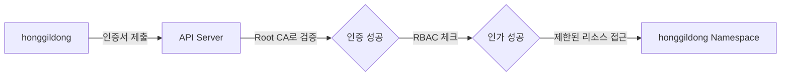

# Kubernetes Client Certificate 인증 실습

일반 사용자(`honggildong`)가 자신만의 네임스페이스에서만 작업을 수행할 수 있도록 인증서 기반의 환경을 구축하는 실습입니다.

---

## 실습 개요

본 실습에서는 X.509 클라이언트 인증서 발급부터 RBAC 권한 할당까지의 전체 과정을 다룹니다.

| 단계 | 작업 내용 | 비고 |
|------|-----------|------|
| **1. 키 생성** | 사용자 전용 개인키와 CSR을 생성합니다. | `openssl` 사용 |
| **2. 인증서 발급** | Kubernetes Root CA를 이용해 CSR에 서명합니다. | `ca.key` 필요 |
| **3. 환경 설정** | `kubeconfig` 파일을 생성하여 접속 정보를 설정합니다. | `kubectl config` |
| **4. 권한 부여** | Role과 RoleBinding을 통해 네임스페이스 권한을 줍니다. | RBAC 적용 |

---

## 실습 아키텍처



---

## 1단계: 사용자 개인키 및 CSR 생성

사용자의 신분증이 될 인증서를 만들기 위해 먼저 개인키와 서명 요청서(CSR)를 생성합니다.

```bash
# 작업 디렉토리 생성
mkdir -p ~/users/honggildong && cd ~/users/honggildong

# 1. 개인키 생성
openssl genrsa -out honggildong.key 2048

# 2. CSR 생성 (CN은 사용자명, O는 그룹명으로 인식됨)
openssl req -new -key honggildong.key \
  -out honggildong.csr \
  -subj "/CN=honggildong/O=developers"
```

---

## 2단계: 인증서 발급 (서명)

마스터 노드에 있는 Kubernetes Root CA 키를 사용하여 사용자 인증서에 서명합니다.

```bash
# Root CA의 키를 사용하여 365일 유효한 인증서 발급
openssl x509 -req -in honggildong.csr \
  -CA /etc/kubernetes/pki/ca.crt \
  -CAkey /etc/kubernetes/pki/ca.key \
  -CAcreateserial \
  -out honggildong.crt \
  -days 365
```

---

## 3단계: Kubeconfig 설정

생성된 인증서를 사용하여 `kubectl` 명령어를 사용할 수 있도록 설정 파일을 구성합니다.

```bash
# 1. 클러스터 정보 등록
kubectl config set-cluster kubernetes \
  --certificate-authority=/etc/kubernetes/pki/ca.crt \
  --embed-certs=true \
  --server=https://172.31.1.10:6443 \
  --kubeconfig=honggildong.conf

# 2. 사용자 인증 정보 등록
kubectl config set-credentials honggildong \
  --client-certificate=honggildong.crt \
  --client-key=honggildong.key \
  --embed-certs=true \
  --kubeconfig=honggildong.conf

# 3. 컨텍스트 설정
kubectl config set-context honggildong-context \
  --cluster=kubernetes \
  --user=honggildong \
  --namespace=honggildong \
  --kubeconfig=honggildong.conf
```

---

## 4단계: RBAC 권한 부여 (관리자 계정에서 수행)

인증은 되었지만 아직 아무런 권한이 없습니다. 해당 사용자가 자신의 네임스페이스에서만 작업할 수 있도록 권한을 줍니다.

```yaml
# role-binding.yaml
apiVersion: rbac.authorization.k8s.io/v1
kind: RoleBinding
metadata:
  name: honggildong-admin
  namespace: honggildong
subjects:
- kind: User
  name: honggildong # 인증서의 CN과 일치해야 함
  apiGroup: rbac.authorization.k8s.io
roleRef:
  kind: ClusterRole
  name: admin # 기본 제공되는 admin 권한 사용
  apiGroup: rbac.authorization.k8s.io
```

**이제 `honggildong.conf` 파일을 가진 사용자는 지정된 네임스페이스 내에서만 안전하게 작업을 수행할 수 있습니다.**
