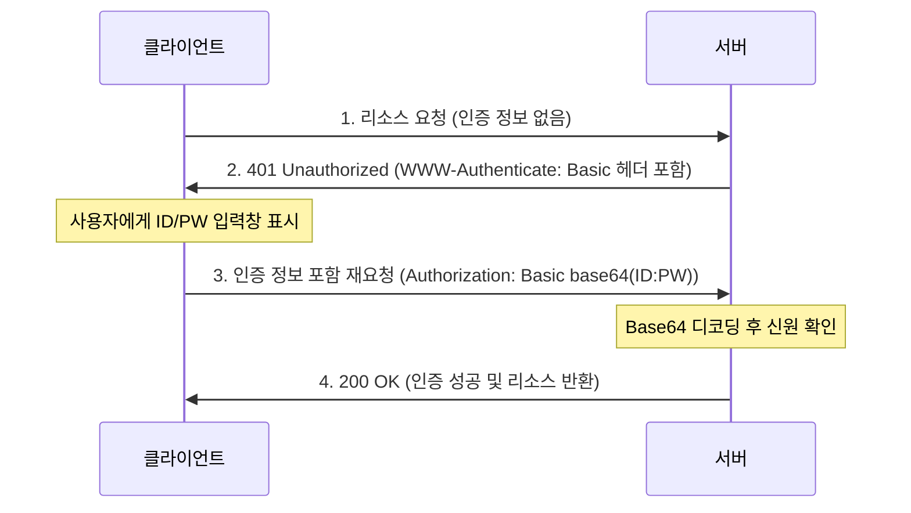

# HTTP Basic Authentication

HTTP 기본 인증 (Basic Auth)의 개념과 특징에 대해 알아봅니다.

---

## HTTP Basic Authentication 이란?

HTTP 기본 인증은 웹 브라우저나 클라이언트가 서버에 사용자 이름과 비밀번호를 전송하여 자신을 인증하는 가장 단순한 방식입니다.

### 핵심 특징

| 구분 | 내용 | 비고 |
|------|------|------|
| **구성 요소** | 사용자명 (Username) + 비밀번호 (Password) | `:` 문자로 연결 |
| **인코딩** | Base64 인코딩 | 암호화가 아닌 텍스트 변환임 |
| **표준** | RFC 7617 | HTTP 표준 프로토콜 |
| **상태** | **Kubernetes v1.19 이후 제거됨** | 보안상의 이유로 사용 비권장 |

---

## Basic Auth 동작 원리

HTTP 프로토콜의 Challenge-Response 메커니즘을 사용하여 인증을 수행합니다.

---

## 보안 취약점

1.  **암호화 부재:** Base64 인코딩은 누구나 쉽게 디코딩할 수 있으므로, 반드시 **HTTPS(TLS)**와 함께 사용해야 합니다. 평문 HTTP 환경에서 사용 시 네트워크 패킷 탈취만으로 비밀번호가 노출됩니다.
2.  **로그아웃 어려움:** 브라우저가 인증 정보를 메모리에 유지하므로, 브라우저를 완전히 닫기 전까지는 로그아웃이 어렵습니다.
3.  **관리의 어려움:** 사용자 정보를 서버 측에서 파일이나 DB로 직접 관리해야 하므로 대규모 환경에는 부적합합니다.

---

## Kubernetes 에서의 대체제

Kubernetes는 더 이상 Basic Auth를 지원하지 않으며, 다음과 같은 더 안전한 방식을 권장합니다.

- **X.509 Client Certificates:** 인증서 기반의 강력한 인증
- **Bearer Tokens:** ServiceAccount 또는 정적 토큰 사용
- **OIDC (OpenID Connect):** Google, Okta 등 외부 IDP 연동
- **Webhook Token Authentication:** 외부 인증 서비스에 검증 위임

**기본 인증은 구조가 단순하여 이해하기 좋으나, 실무 환경(특히 Kubernetes)에서는 보안상의 이유로 더 현대적인 인증 방식을 사용해야 합니다.**
