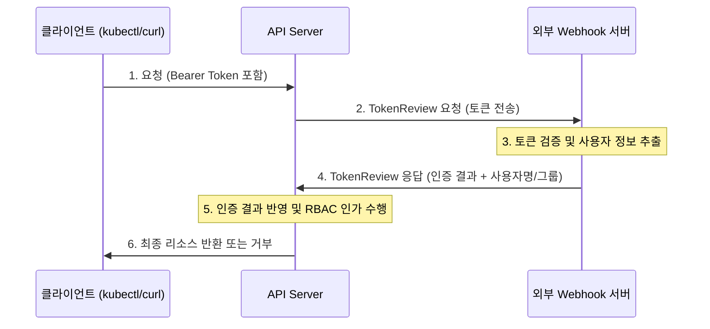

# API Server Webhook Token Authentication

Kubernetes API Server의 Webhook Token Authentication 에 대해 알아봅니다.

---

## Webhook Token Authentication 이란?

Webhook Token Authentication은 API 서버가 토큰 인증을 직접 수행하지 않고, **외부의 웹훅 서버(Webhook Server)에 신원 확인을 위임**하는 방식입니다.

### 핵심 개념

- **확장성:** Kubernetes 기본 기능으로 지원하지 않는 복잡한 인증 로직을 구현할 수 있습니다.
- **통합:** 사내 LDAP, Active Directory 또는 기존 인증 시스템과 Kubernetes를 손쉽게 통합할 수 있습니다.
- **위임:** API 서버는 단순히 토큰을 전달하고, 외부 서버의 응답(Success/Fail)에 따라 인증 여부를 결정합니다.

---

## 동작 원리

API 서버와 외부 웹훅 서버 간의 통신은 `TokenReview`라는 특별한 API 객체를 통해 이루어집니다.



---

## 설정 방법 요약

### 1. Webhook 설정 파일 생성
API 서버가 어떤 웹훅 서버로 데이터를 보낼지 정의하는 설정 파일(`webhook-config.yaml`)이 필요합니다.

| 항목 | 설명 | 비고 |
|------|------|------|
| **clusters** | 웹훅 서버의 주소(URL) 및 CA 인증서 | HTTPS 권장 |
| **users** | API 서버가 웹훅 서버에 접속할 때 쓸 인증 정보 | (선택 사항) |

### 2. API Server 옵션 추가
마스터 노드의 `kube-apiserver` 설정에 웹훅 사용을 명시합니다.

```bash
# kube-apiserver.yaml 수정 예시
- --authentication-token-webhook-config-file=/etc/kubernetes/pki/webhook-config.yaml
- --authentication-token-webhook-cache-ttl=2m
```

---

## 장단점 요약

| 장점 | 단점 |
|------|------|
| - 기존 사내 인증 시스템과 완벽한 통합 가능 | - 외부 웹훅 서버 장애 시 인증이 불가능함 (SPOF) |
| - 중앙 집중식 사용자 관리 가능 | - 네트워크 지연(Latency)이 발생할 수 있음 |
| - 복잡한 보안 정책(IP 제한 등) 연동 가능 | - 웹훅 서버를 별도로 구축/관리해야 하는 부담 |

**Webhook 방식은 엔터프라이즈 환경에서 Kubernetes를 기존의 보안 체계와 통합할 때 가장 유연하게 대처할 수 있는 강력한 인증 수단입니다.**
