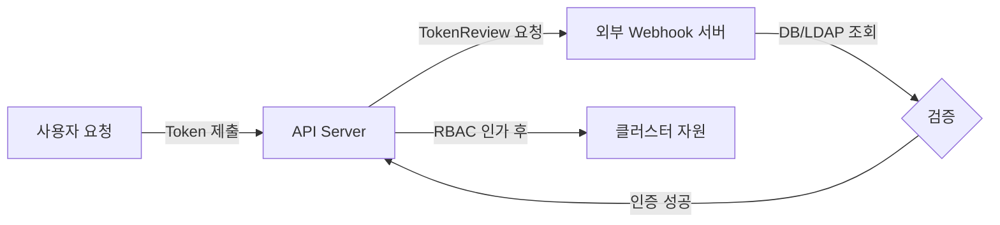

# API Server 인증 플러그인을 Webhook 인증으로 변경하는 절차

Kubernetes API 서버의 인증 방식을 외부 웹훅(Webhook) 서버 기반으로 전환하는 실습 절차입니다.

---

## 작업 개요

본 실습에서는 API 서버의 기본 인증 방식을 확장하여 외부 서비스에 인증을 위임하는 과정을 다룹니다.

| 단계 | 작업 내용 | 비고 |
|------|-----------|------|
| **1. 사전 점검** | 현재 API 서버의 인증 설정을 확인합니다. | `kube-apiserver.yaml` |
| **2. 서버 구축** | 토큰을 검증할 외부 웹훅 서버를 준비합니다. | HTTPS 기반 서버 |
| **3. 설정 구성** | API 서버가 웹훅을 호출할 때 쓸 설정 파일을 작성합니다. | `webhook-config.yaml` |
| **4. 서버 적용** | API 서버의 실행 옵션을 수정하여 웹훅을 활성화합니다. | 컨트롤 플레인 재시작 |

---

## 인증 전환 아키텍처



---

## 1단계: 현재 인증 설정 확인

현재 클러스터가 사용 중인 인증 방식을 마스터 노드에서 확인합니다.

```bash
# API Server 설정 파일 확인
grep -E "mode|auth" /etc/kubernetes/manifests/kube-apiserver.yaml

# 기본 설정 예시:
# - --authorization-mode=Node,RBAC
# - --client-ca-file=/etc/kubernetes/pki/ca.crt
```

---

## 2단계: Webhook 설정 파일 작성 (`/etc/kubernetes/pki/webhook-config.yaml`)

API 서버가 외부 웹훅 서버와 통신하기 위한 주소와 인증 정보를 정의합니다.

```yaml
apiVersion: v1
kind: Config
clusters:
- name: external-auth-service
  cluster:
    server: https://auth.example.com/authenticate # 웹훅 서버 주소
    certificate-authority: /etc/kubernetes/pki/ca.crt # 웹훅 서버 검증용 CA
users:
- name: kube-apiserver
  user:
    client-certificate: /etc/kubernetes/pki/apiserver.crt
    client-key: /etc/kubernetes/pki/apiserver.key
contexts:
- context:
    cluster: external-auth-service
    user: kube-apiserver
  name: webhook-auth-context
current-context: webhook-auth-context
```

---

## 3단계: API Server 옵션 수정

마스터 노드에서 `kube-apiserver.yaml` 파일을 수정하여 웹훅 인증을 활성화합니다.

```yaml
# /etc/kubernetes/manifests/kube-apiserver.yaml 수정
spec:
  containers:
  - command:
    - kube-apiserver
    ...
    - --authentication-token-webhook-config-file=/etc/kubernetes/pki/webhook-config.yaml
    - --authentication-token-webhook-cache-ttl=5m
```

---

## 주의사항 및 팁

1.  **SPOF 주의:** 외부 웹훅 서버가 다운되면 클러스터 인증 자체가 마비될 수 있습니다. 고가용성(HA) 구성이 권장됩니다.
2.  **인증 실패 로그:** 문제가 발생할 경우 API 서버의 로그(`kubectl logs -n kube-system <apiserver-pod>`)를 통해 웹훅 서버와의 통신 에러를 확인하세요.
3.  **캐시 활용:** `--authentication-token-webhook-cache-ttl` 옵션을 통해 외부 서버에 대한 부하를 줄이고 인증 성능을 높일 수 있습니다.

**Webhook 인증 구성을 완료하면 Kubernetes 클러스터를 기업 내부의 통합 인증 시스템과 유연하게 연동할 수 있습니다.**
