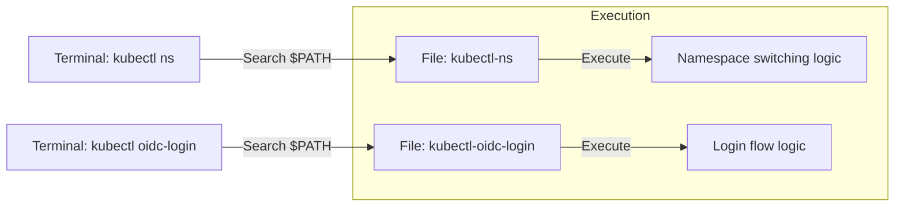

# kubectl plugin 개발 가이드

kubectl plugin은 kubectl 명령어를 사용자의 입맛에 맞게 확장하는 가장 쉬운 방법입니다.

---

## kubectl plugin 이란?

kubectl plugin은 `kubectl`의 하위 명령어로 작동하는 독립적인 실행 파일입니다. 이를 통해 복잡한 명령어를 단순화하거나 클러스터 관리에 필요한 커스텀 도구를 만들 수 있습니다.

### 주요 특징

| 항목 | 내용 | 비고 |
|------|------|------|
| **명명 규칙** | `kubectl-<plugin-name>` 형식을 따라야 함 | 필수 |
| **파일 위치** | 사용자의 `$PATH` 환경 변수에 등록된 경로 | 필수 |
| **실행 방식** | `kubectl <plugin-name>`으로 호출 | - |
| **개발 언어** | 실행 가능한 파일이라면 어떤 언어든 가능 (Bash, Go, Python 등) | 유연성 |

---

## plugin 명령어 규칙

사용자가 터미널에서 입력하는 명령어와 실제 파일명의 관계를 시각화하면 다음과 같습니다.



---

## 1단계: 가장 간단한 plugin 제작 (Bash)

### 1. 스크립트 작성
인사를 건네는 아주 단순한 플러그인을 만들어 봅니다.

```bash
# /usr/local/bin/kubectl-hello 파일 생성
cat <<'EOF' > /usr/local/bin/kubectl-hello
#!/bin/bash
echo "Hello! This is a custom kubectl plugin."
EOF
```

### 2. 권한 부여 및 확인
```bash
# 실행 권한 부여
chmod +x /usr/local/bin/kubectl-hello

# 설치된 플러그인 목록 확인
kubectl plugin list
```

### 3. 사용
```bash
kubectl hello
# 출력: Hello! This is a custom kubectl plugin.
```

---

## 2단계: 실무형 plugin 예시 (네임스페이스 전환)

실제로 자주 쓰이는 네임스페이스 전환 도구를 Bash로 구현한 예시입니다.

```bash
#!/bin/bash
# 파일명: kubectl-ns
if [ -z "$1" ]; then
  kubectl config view --minify | grep namespace
else
  kubectl config set-context --current --namespace="$1"
  echo "Context switched to namespace '$1'."
fi
```

---

## 핵심 요약

1.  **규칙:** 파일명은 반드시 `kubectl-`로 시작해야 합니다.
2.  **배포:** 파일을 `$PATH` 경로에 복사하고 `chmod +x`로 실행 권한을 주면 설치가 끝납니다.
3.  **관리:** `kubectl plugin list` 명령어로 현재 사용 가능한 플러그인들을 한눈에 볼 수 있습니다.
4.  **추천 도구:** 더 많은 플러그인을 쉽게 관리하려면 플러그인 매니저인 **Krew**를 사용하세요.

**플러그인을 활용하면 반복되는 복잡한 kubectl 옵션들을 자신만의 단축 명령어로 만들어 업무 효율을 극대화할 수 있습니다.**
