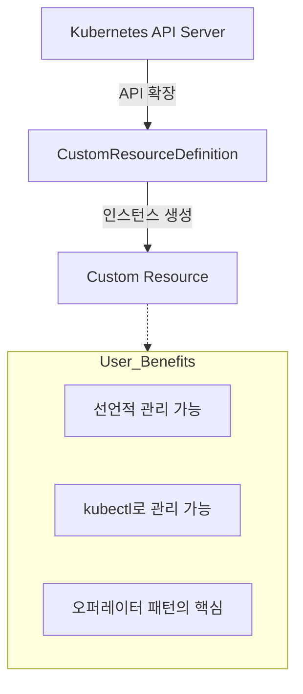

# CustomResourceDefinition (CRD)

Kubernetes API를 확장하여 사용자가 직접 정의한 새로운 리소스 타입을 만드는 방법입니다.

---

## 1. CRD 란?

CRD는 Kubernetes의 기본 리소스(Pod, Service 등) 외에, 사용자의 비즈니스 로직에 필요한 **커스텀 리소스**를 추가하는 메커니즘입니다.

### 핵심 개념 비교

| 구분 | Kubernetes 기본 리소스 | 사용자 정의 리소스 (CRD) |
|------|-----------------------|-------------------------|
| **예시** | Pod, Deployment, ConfigMap | Database, Kafka, RedisCluster |
| **정의 주체** | Kubernetes 개발팀 (Built-in) | 클러스터 운영자/사용자 |
| **비유** | **기성복:** 표준 사이즈로 제작됨 | **맞춤복:** 내 몸(비즈니스)에 딱 맞게 제작 |
| **유연성** | 제한적 (필드 수정 불가) | 무한함 (원하는 필드 정의 가능) |

---

## 2. CRD의 역할과 가치

1.  **선언적 인프라:** 복잡한 앱 설정을 YAML 파일 하나로 정의하고 관리할 수 있습니다.
2.  **도구 통합:** 별도의 도구 없이 `kubectl get <my-resource>` 명령어로 상태를 확인할 수 있습니다.
3.  **오퍼레이터 연동:** CRD로 정의된 상태를 감시하며 자동화를 수행하는 '오퍼레이터'를 통해 진정한 자동화를 실현합니다.

---

## 3. CRD vs 기본 리소스 상세

| 특징 | 기본 리소스 (Built-in) | CRD (Extension) |
|------|-----------------------|----------------|
| **가용성** | 모든 K8s 클러스터에서 즉시 사용 가능 | CRD 리소스를 먼저 생성(설치)해야 함 |
| **API 그룹** | `v1`, `apps/v1` 등 표준 그룹 | `example.com`, `stable.dw.com` 등 커스텀 그룹 |
| **데이터 저장** | etcd의 표준 경로에 저장 | etcd의 사용자 정의 경로에 저장 |
| **버전 관리** | K8s 릴리스 주기에 따라 업데이트 | 사용자가 자유롭게 버전 관리 (v1alpha1, v1 등) |

---

## 4. 요약

CRD를 사용하면 Kubernetes를 단순한 컨테이너 오케스트레이터를 넘어, **"사용자 정의 데이터베이스"**이자 **"범용 제어 평면(Control Plane)"**으로 변모시킬 수 있습니다.

**CRD는 현대적인 클라우드 네이티브 애플리케이션 운영의 핵심인 '오퍼레이터 패턴'을 구현하기 위한 필수적인 첫걸음입니다.**
