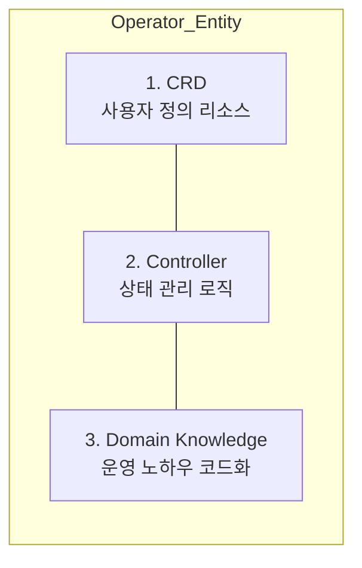

# Operator 개발 가이드

Kubernetes Operator를 개발하는 방법과 효율적인 개발을 돕는 다양한 도구들을 소개합니다.

---

## Operator 란?

Operator는 인간 운영자의 지식을 코드로 구현하여 복잡한 애플리케이션을 자동으로 관리하는 소프트웨어 확장입니다.

### 핵심 개념 비교

| 구분 | 수동 운영 (Manual) | Operator 자동화 |
|------|--------------------|-----------------|
| **모니터링** | 사람이 직접 대시보드 확인 | 24시간 자동 감시 및 상태 체크 |
| **장애 복구** | 수동으로 Pod 재시작 및 데이터 복구 | 장애 감지 시 즉시 자동 복구 수행 |
| **백업/업그레이드** | 점검 공지 후 수동 작업 | 스케줄에 따른 자동 백업 및 무중단 업그레이드 |
| **비유** | 119 구조대원 (필요시 출동) | 자율주행 관리 로봇 |

---

## Operator의 3대 구성 요소

Operator는 다음 세 가지가 결합되어 완성됩니다.

1.  **CRD (Custom Resource Definition):** 애플리케이션의 설정을 정의하는 새로운 API 객체 (예: `kind: Database`)
2.  **Controller:** 리소스를 감시하고 '원하는 상태'가 되도록 조치하는 루프(Reconcile Loop)
3.  **Domain Knowledge:** 특정 앱(MySQL, Kafka 등)을 어떻게 백업하고 어떻게 확장해야 하는지에 대한 전문 지식

---

## 왜 도구가 필요한가?

Kubernetes 컨트롤러를 바닥부터 직접 만드는 것은 매우 복잡합니다.

| 어려운 점 | 상세 내용 |
|-----------|----------|
| **저수준 API** | `client-go`, Informer, Lister 등 복잡한 라이브러리 이해 필요 |
| **상태 동기화** | `Watch` 메커니즘을 이용한 실시간 이벤트 처리 로직 구현 |
| **Reconcile 루프** | 멱등성(Idempotency)을 보장하는 정교한 제어 로직 설계 |
| **반복 코드** | 매번 작성해야 하는 방대한 양의 보일러플레이트 코드 |

**이러한 복잡성을 해결하기 위해 Operator SDK, Kubebuilder와 같은 프레임워크 사용이 권장됩니다.**

---

## 주요 개발 프레임워크

- **Operator SDK:** Helm, Ansible, Go를 지원하며 CNCF 프로젝트로 널리 사용됨
- **Kubebuilder:** Go 기반의 표준적인 컨트롤러 개발 도구
- **KUDO:** 선언적인 YAML 방식으로 오퍼레이터 구축

**오퍼레이터 개발은 단순한 배포를 넘어 애플리케이션의 생명주기 전체를 자동화하는 여정입니다.**
