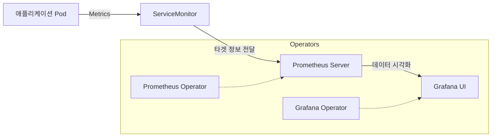
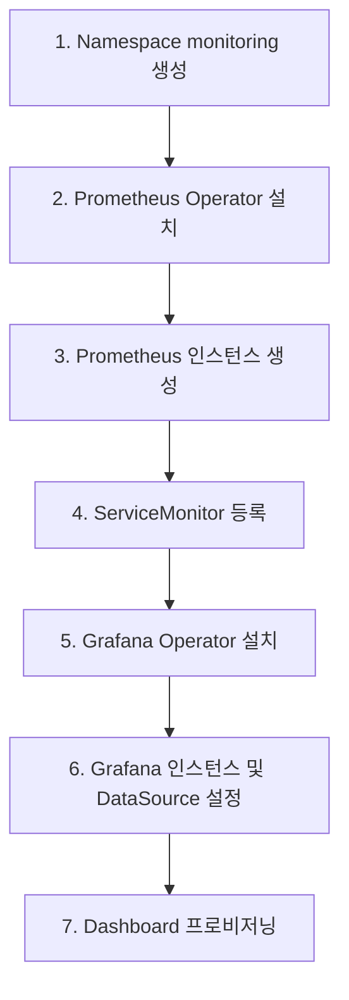

# Prometheus & Grafana Operator 설치 실습

Kubernetes 환경에서 Operator 패턴을 활용하여 모니터링 시스템을 구축하고 자동화하는 실습 가이드입니다.

---

## 1. 실습 개요 및 아키텍처

본 실습에서는 Prometheus와 Grafana를 수동으로 배포하는 대신, Operator를 통해 이들의 생명주기를 관리하는 방법을 배웁니다.

| 구성 요소 | 역할 | 비고 |
|-----------|------|------|
| **Prometheus Operator** | Prometheus 서버, Alertmanager, ServiceMonitor 관리 | 타겟 자동 발견 |
| **Grafana Operator** | Grafana 인스턴스, DataSource, Dashboard 관리 | 설정 자동화 |
| **ServiceMonitor** | 어떤 서비스에서 메트릭을 수집할지 정의하는 CRD | 핵심 설정 객체 |

---

## 2. 전체 데이터 흐름



---

## 3. 설치 단계 요약

### [1단계] 네임스페이스 생성
```bash
kubectl create namespace monitoring
```

### [2단계] Prometheus Operator 설치 (Helm)
```bash
helm repo add prometheus-community https://prometheus-community.github.io/helm-charts
helm install prometheus prometheus-community/kube-prometheus-stack --namespace monitoring
```

### [3단계] Grafana Operator 설치 (Helm)
```bash
helm repo add grafana-operator https://grafana-operator.github.io/grafana-operator/helm-charts
helm install grafana-operator grafana-operator/grafana-operator --namespace monitoring
```

---

## 4. 핵심 리소스 정의 (CRD)

Operator 설치 후에는 다음과 같은 커스텀 리소스를 통해 설정을 관리합니다.

| 리소스 유형 | 용도 |
|-------------|------|
| **Prometheus** | 실제 Prometheus 서버 인스턴스를 정의 |
| **ServiceMonitor** | 메트릭을 수집할 엔드포인트(Service) 지정 |
| **Grafana** | Grafana 서버 인스턴스 정의 |
| **GrafanaDatasource** | Grafana에 연결할 데이터 소스(Prometheus 등) 설정 |
| **GrafanaDashboard** | JSON 또는 Grafana.com ID를 통한 대시보드 배포 |

---

## 5. 설치 순서 워크플로우



---

## 6. 요약

Prometheus와 Grafana Operator를 사용하면 **"모니터링 대상이 추가될 때마다 설정을 직접 수정할 필요 없이"**, 단지 `ServiceMonitor` 리소스를 추가하는 것만으로 메트릭 수집을 자동화할 수 있습니다. 이는 선언적 인프라 관리의 핵심 가치를 보여줍니다.
